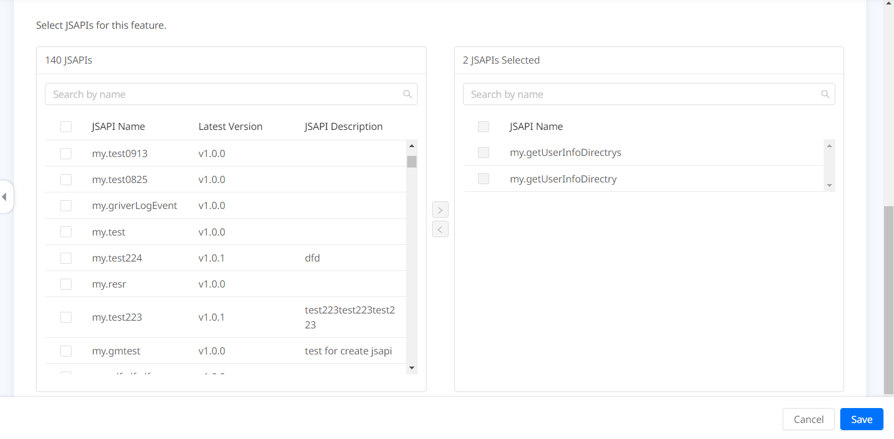

# Personalizar JSAPIs

Después de integrar el SDK IAPminiprogram en su aplicación, los JSAPIS incorporados están fácilmente disponibles para que los mini programas llamen para lograr características básicas. Una lista de estos JSAPIS y sus características se pueden encontrar en la [referencia de JSAPI](/). Además, si desea extender aún más la funcionalidad, el SDK ofrece la capacidad de personalizar JSAPIS. Con esta capacidad, puede crear un nuevo JSAPI o reemplazar la implementación predeterminada de un JSAPI incorporado existente. Para agregar o anular un JSAPI, siga las instrucciones paso a paso a continuación.

## Procedimientos

### Paso 1: Definir e implementar el JSAPI

Defina e implementa el JSAPI a través de los siguientes tres pasos.

### 1. Agregue una nueva clase

Crear una nueva clase que se extienda `RVKJsApiHandler` con XCode, que genera estos dos archivos: _className.h_ y _className.m_.

Aquí, una clase de ejemplo nombrada `TestJsApiHandler` se crea, que genera el _TestJsApiHandler.h_ y archivos _TestJsApiHandler.m_. El siguiente código de muestra es del archivo anterior:

```js
#import <AriverKernel/AriverKernel.h>

NS_ASSUME_NONNULL_BEGIN

@interface TestJsApiHandler : RVKJsApiHandler

@end

NS_ASSUME_NONNULL_END
```

### Override el método de implementación

En el archivo de implementación (que es theTestJsApiHandler.m Archivo en nuestro ejemplo), sobreescriba el método `-handler:context:callback:` y proporcionar una lógica comercial para manejar la llamada JSAPI. Aquí hay un código de muestra para sobreescriba el método de implementación:

#import "TestJsApiHandler.h"

```
@implementation TestJsApiHandler

- (void)handler:(NSDictionary *)data context:(RVKContext *)context callback:(RVKJsApiResponseCallbackBlock)callback {
    // Procesar los datos de entrada
    // Aplicar la lógica comercial
    NSMutableDictionary *result = [@{} mutableCopy];
    [result setValue:@"value1" forKey:@"result1"];
    [result setValue:@"value2" forKey:@"result2"];

    callback(result);
}

@end
```

Para obtener más información sobre los parámetros en este método, consulte los [parámetros para el método de implementación](/). Para devolver las respuestas a Mini Programas, construya un objeto de _result_ donde pueda especificar el nombre del parámetro de respuesta con Forkey y el valor del parámetro con _setValue_. Para devolver una respuesta de error, especifique el error y los parámetros de _errorMessage_ con _forkey_.

### Configurar el archivo JSAPI plistt

Para configurar el archivo JSAPI plist, agréguelo primero al proyecto. Si ya existe un archivo, configúrelo para registrar la información de las clases JSAPI. En el archivo plist, agregue contenido dentro de la etiqueta `<Plist>` con el siguiente código de muestra:

```xml
<dict>
  <key>JsApiRuntime</key>
  <dict>
    <key>JsApis</key>
    <array>
      <dict>
        <key>name</key>
        <string>TestJsApiHandler</string>
        <key>jsApi</key>
        <string>testAPI</string>
      </dict>
        </array>
    </dict>
</dict>
```

En la matriz `JsApis`, cada etiqueta `<dict>` representa un solo JSAPI. Dentro de la etiqueta `<dict>`, establezca la tecla de nombre con el nombre de la clase implementada y defina el nombre JSAPI con `jsApi`. Este proceso establece un mapeo uno a uno entre la clase y el JSAPI, y este mapeo es exclusivo. En otras palabras, cada clase se asigna a un JSAPI único y viceversa. Al especificar el nombre de la clase y el nombre de JSAPI, preste atención a las siguientes cosas:

- Para Swift classes (pura Swift class o inheriting NSObject), El nombre de la clase real está en el formato`PRODUCT_MODULE_NAME.fooBar`, dónde `PRODUCT_MODULE_NAME` es lo mismo que la configuración de su objetivo. Por ejemplo, si `TestJsApiHandler` está escrito en Swift desde el proyecto `GriverDemo`, tcuando el valor para la tecla de `name` es `GriverDemo.TestJsApiHandler`.
- Dependiendo de sus necesidades específicas, puede definir el nombre de JSAPI de cualquiera de estas dos maneras:
  - Use un nombre que sea diferente de todos los JSapis incorporados, que crea un nuevo JSAPI.
  - Use el nombre de un JSAPI incorporado, que le permite anular la implementación predeterminada de este JSAPI.

### Paso 2: Registre el JSAPI a SDK

Registre el archivo PLIST en su configuración SDK e inicialice el SDK.Consulte el siguiente código de muestra para obtener más detalles:

```java
GRVConfiguration *grvConfig = [[GRVConfiguration alloc] init];
grvConfig.plistFilePathForExtraPlugins = @"PATH_TO_YOUR_PLIST";
```

### Paso 3: Registre la plataforma JSAPI en Mini Program

Registre su plataforma JSAPIS personalizada en Mini Program para que los mini programas puedan acceder a estos JSAPIS.En el espacio de trabajo de su inquilino, solo el administrador del espacio de trabajo puede realizar los siguientes dos pasos para completar esta acción.

Registre un nuevo JSAPI
Complete los siguientes tres pasos para registrar el nuevo JSAPI:

1. Inicie sesión en [Mini Program Platform](/) y navegue a **JSAPIS**.


2. Click + New JSAPI y complete los campos requeridos de acuerdo con la ayuda integrada y también las siguientes instrucciones:
   - JSAPI Name: Ingrese el mismo nombre del método que especifique en el paso 1.3 Configure el archivo JSAPI Plist. Por ejemplo, en las muestras anteriores, el nombre es Testapi.
   - App: Seleccione las Super Aplicaciones que admiten este JSAPI.
3. Click Confirm Para terminar el registro.Luego, el JSAPI agregado aparece en la lista JSAPI.

###Agregue el JSAPI a una función
Luego, agregue el JSAPI a una función. Una característica es básicamente una funcionalidad comercial que se logra por un conjunto de JSAPIS. Por ejemplo, para JSAPIS relacionados con el pago, puede agregarlos a una característica llamada pago. Hay dos escenarios que puede esperar al agregar el JSAPI a una función. Siga los pasos que son apropiados para su escenario específico:

    - [Agregue el JSAPI a una nueva característica](/)
    - [Agregue el JSAPI a una característica existente](/)

### Agregue el JSAPI a una nueva característica

1. In mini plataforma de programa, navegue a Features y click + **Add Feature**.
2. Complete los detalles de la función de acuerdo con la ayuda e instrucciones integradas a continuación:
   - Establecer la visibilidad de la función: Cambie todos los mini programas pueden ver este botón de alternancia de características si desea que la función sea visible para todos los programas mini tanto en el espacio de trabajo de los inquilinos como en los espacios de trabajo de desarrolladores asociados. De lo contrario, esta característica está oculta a menos que la comparta con cualquier mini programa después de la creación. Para obtener más información sobre el intercambio de funciones, consulte [cómo compartir una característica con Mini Programas Target](/).
   - Añade el JSAPI: Todos los JSAPI registrados en la plataforma se enumeran en el panel izquierdo. Busque y seleccione los JSAPIS que están relacionados con esta característica particular y click en ＞ sign Para agregarlos. Verifique los JSAPIs agregados que aparecen en el panel derecho y luego click **Confirm**.


### ADD el JSAPI a una característica existente
1. En la plataforma Mini Program, navegue a las funciones y encuentre la función existente a la que desea agregar el JSAPI.
2. Haga clic en el nombre de la función y haga clic en Editar en la página siguiente.
3. En la página de la función **Editar**, desplácese hacia abajo hasta la parte JSAPIS directamente. Todos los JSAPI registrados en la plataforma se enumeran en el panel izquierdo. Busque y seleccione los JSAPIS que están relacionados con esta característica particular y haga clic en el signo ＞ para agregarlos. Verifique los JSAPIs agregados que aparecen en el panel derecho y luego haga clic en **save**.



## Apéndices
### Parámetros para el método de implementación
<table>
    <tr>
        <th>Tipo de parámetro</th>
        <th>Tipo de datos</th>
        <th>Descripción</th>
    </tr>
    <tr>
        <td>data</td>
        <td>NSDictionary</td>
        <td>
        Los parámetros de solicitud del JSAPI. Los tipos de datos compatibles son:
            - String
            - Integer
            - Double
            - Long
            - Boolean
        </td>
    </tr>
    <tr>
        <td>context</td>
        <td>RVKContext</td>
        <td>Los parámetros para obtener información sobre el mini programa en ejecución actualmente desde el contexto, por ejemplo, la instancia de controlador de ejecución de mini programa.</td>
    </tr>
    <tr>
        <td>callback</td>
        <td>RVKJsApiResponseCallbackBlock</td>
        <td>El método de devolución de llamada para devolver una respuesta al programa mini llamado.</td>
    </tr>
</table>


## How to share a feature with target mini programs
Para una función de mini programa, cuando todos los programas Mini pueden ver esta alternancia de características apagada, Workspace Admin debe establecer su visibilidad seleccionando Mini Programas para compartir. Tome los siguientes pasos para compartir una característica con Mini Programas Target:

1. In mini plataforma de programa, navegue a las **Features** y encuentre la función que desea compartir.
2. Haga clic en el nombre de la función para ver los detalles y haga clic en la pestaña **Who will be able to view this**.


3. **Click + Share with** para seleccionar mini programas para compartir. Todos los mini programas del espacio de trabajo del inquilino y los espacios de trabajo del desarrollador se enumeran en el panel izquierdo. Buscar y marcar los mini programas de destino y click en ＞ sign Para agregarlos. Verifique los mini programas agregados que aparecen en el panel derecho y luego click **Confirm**.

## Próximos pasos
Después de personalizar JSAPIS, Super Apps necesita instruir a los desarrolladores de mini programas para que utilicen estos JSAPI. Para obtener más *información*, consulte [Guía Mini Programas para llamar a JSAPIS personalizados](/).


<table>
    <tr>
        <th>Field</th>
        <th>Data type</th>
        <th>Description</th>
        <th>Required</th>
    </tr>
    <tr>
        <td>identifier</td>
        <td>NSString *</td>
        <td>
        Un identificador que la superpción [especifica](/) para **representar** al *encriptador*. El SDK pasa a este identificador al SDK al método ```decrypt:identifier:``` para [```indicar```](/) que los datos están encriptados y determinar si ejecutar la lógica de descifrado.
        </td>
        <td>M</td>
    </tr>
</table>

<table>
    <tr>
        <th></th>
        <th></th>
        <th></th>
        <th></th>
    </tr>
    <tr>
        <td></td>
        <td></td>
        <td></td>
        <td></td>
    </tr>
    <tr>
        <td></td>
        <td></td>
        <td></td>
        <td></td>
    </tr>
    <tr>
        <td></td>
        <td></td>
        <td></td>
        <td></td>
    </tr>
    <tr>
        <td></td>
        <td></td>
        <td></td>
        <td></td>
    </tr>
</table>


