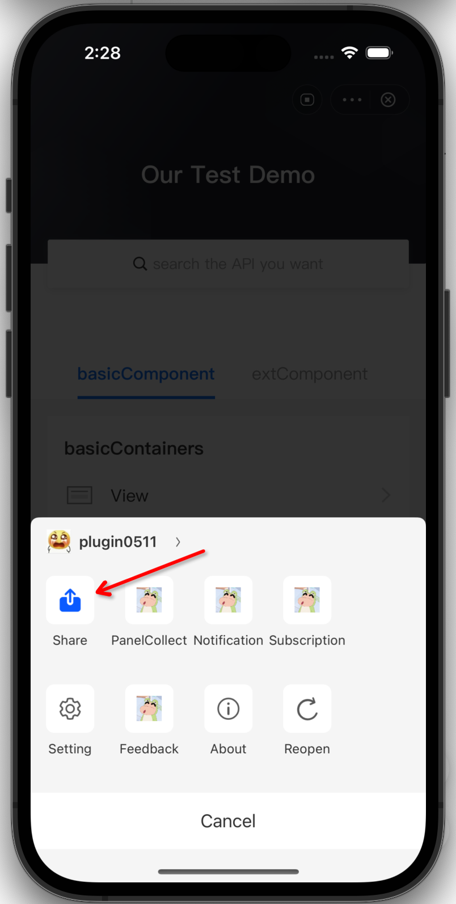
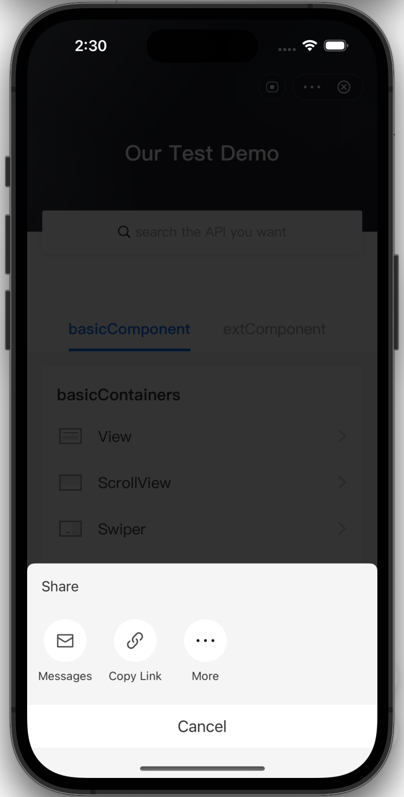

# Personalizar la capacidad de compartir

El mini programa se puede compartir con otros a través de la capacidad compartida proporcionada por el IAPminiprogram SDK.Otros que reciben el enlace compartido a través de Facebook, Twitter u otras aplicaciones pueden abrir el programa Mini compartido.

Este tema lo guía a través de cómo personalizar la capacidad de compartir con el SDK en los siguientes aspectos:

* Personalice los canales de compartir que admite su aplicación, como Facebook, Twitter, WhatsApp, etc.
* Personalice el panel de acciones.

## Habilitar la capacidad de compartir
Asegúrese de que la capacidad de acciones esté habilitada antes de implementar la personalización.

### Experiencia de usuario predeterminada
Después de habilitar la capacidad de compartir, puede encontrar el menú Compartir en el panel de menú.Si hace clic en el menú Compartir, se muestra el panel Compartir.

La siguiente tabla muestra la entrada al panel compartido y el panel de acciones predeterminado:





## Procedimientos para habilitar la capacidad de participación
Para habilitar la capacidad de acciones, complete los siguientes pasos:

### Paso 1: Implementar ShareDelegate y makeLink(queryItems:)
Implementar ```theShareDelegate``` protocolo y la función ```makeLink(queryItems:)```. Devuelva el enlace que debe compartirse en la función  ```makeLink(queryItems:)```. Consulte la siguiente muestra para la implementación:

```js
class DemoShareDelegate: NSObject, ShareDelegate {
    func makeLink(queryItems: [URLQueryItem]) -> String {
        return "https://demo?" + queryItems
            .filter { $0.value != nil }
            .map { "\($0.name)=\($0.value!)" }
            .joined(separator: "&")
    }
}
```
Para obtener más información sobre la función, ver [makeLink(queryItems:)](/).


### Paso 2: Configurar Sharedelegate
Configurar Sharedelegate en IAPminiprogram SDK con el siguiente código de muestra:
```js
//  let extensionDelegate = GRVExtensionDelegate()
extensionDelegate.shareDelegate = DemoShareDelegate();
```

## Personalizar los canales de compartir
Después de habilitar la capacidad de acciones, tiene tres canales de acciones por defecto, que se enumeran de la siguiente manera:

- **MessagesShareItem**: Compartir mensaje a SMS.
- **CopyUrlShareItem**: Comparta el mensaje al portapapeles.
- **MoreShareItem**: Compartir mensaje al panel Sistema Compartir.

Si desea compartir mensajes a otros canales, puede hacerlo implementando la fución ```items(for:)```.Consulte la siguiente muestra para la implementación:

```js
class DemoShareDelegate: NSObject, ShareDelegate {

    func makeLink(queryItems: [URLQueryItem]) -> String {
        return "https://demo?" + queryItems
            .filter { $0.value != nil }
            .map { "\($0.name)=\($0.value!)" }
            .joined(separator: "&")
    }
   
    func items(for appId: String) -> [ShareItem] {
        let channel = "Custom"
        let custom = ShareItem(channel: channel, icon: nil) { context, viewController, completion in
            // Haz tu compartir ActionShare
            completion(true, channel)
        }
        return [custom, .system, .copyLink, .messages]
    }
}
```
Para más información sobre la función, ver[ items(for:)](/).

## Personalizar el panel de acciones
IAPMiniprogram SDK proporciona el panel de acciones predeterminado.Si desea personalizar el panel de acciones, complete la función ```theshowPanel(items:context:visibleViewController:completion:)``` con el siguiente código de muestra.

```js
class DemoNewShareDelegate: NSObject, ShareDelegate {
    var items: [ShareItem]?

    func makeLink(queryItems: [URLQueryItem]) -> String {
        return "https://demo?" + queryItems
            .filter { $0.value != nil }
            .map { "\($0.name)=\($0.value!)" }
            .joined(separator: "&")
    }
   
    func items(for appId: String) -> [ShareItem] {
        let channel = "Custom"
        let custom = ShareItem(channel: channel, icon: nil) { context, viewController, completion in
            // Haz tu compartir ActionShare
            completion(true, channel)
        }
        return [custom, .system, .copyLink, .messages]
    }

    func showPanel(items: [ShareItem], context: ShareContext, visibleViewController: UIViewController?, completion: @escaping Completion) {
        self.items = items

        let alertController = UIAlertController(title: context.title, message: context.desc, preferredStyle: .actionSheet)
        items
            .map { item in
                UIAlertAction(title: item.channel, style: .default) { [weak alertController] action in
                    // Haz tu acción de compartir
                    guard let alertController else { return }
                    alertController.dismiss(animated: true) {
                        item.handler?(context, visibleViewController, completion)
                    }
                }
            }
            .forEach(alertController.addAction(_:))

        let cancelAction = UIAlertAction(title: "Cancel", style: .cancel)
        alertController.addAction(cancelAction)
        visibleViewController?.present(alertController, animated: true)
    }
}
```

Para obtener más información sobre la función, ver [showPanel(items:context:visibleViewController:completion:)](/).

:::info[Nota]
 Después de personalizar los canales compartidos, si se muestran los canales de compartir de manera predeterminada depende de lo que devuelva la función ```items(for:)```. Si devuelve los canales de acciones por defecto, se muestran en consecuencia en el panel de acciones. De lo contrario, solo se muestran los canales de compartir personalizados.
- El ciclo de vida del parámetro *items*  necesita ser manejado solo después del showpanel(items:context:visibleViewController:completion:)function is implemented.

:::


## Interfaz
Consulte el siguiente código de muestra para las funciones que deben implementarse para personalizar la capacidad de compartir:

```js
@objc
public protocol ShareDelegate: NSObjectProtocol {
    typealias Completion = (_ result: Bool, _ channel: String?) -> Void

    /// GEnera una cadena de URL para compartir con elementos de consulta adicionales incluidos en la URL.
    /// - Parámetros:
    ///    - queryItems: Una variedad de 'urlqueryitem` para agregar a la URL.
    /// - Returns: Tla cuerda de la url
    func makeLink(queryItems: [URLQueryItem]) -> String

    /// ReTrieja una matriz de objetos `ShareItem` para una identificación de mini del programa mini.
    /// - Parameter appId: La identificación del mini programa para el cual recuperar elementos compartidos.
    /// - Returns: An matriz de objetos `shareItem`.
    @objc optional
    func items(for appId: String) -> [ShareItem]

    /// Presenta un panel de intercambio al usuario, lo que les permite compartir los elementos dados en el contexto dado.
    /// - Parámetros:
    ///    - items: Una variedad de objetos `ShareItem` para mostrar en el panel de intercambio.
    ///    - context:UNA `ShareContext`Objeto que define el contexto en el que se muestra el panel de intercambio.
    ///    - visibleViewController: El controlador de vista desde el cual presentar el panel de intercambio.Si no se especifica ninguno, se utilizará el controlador de vista superior.
    ///    - completion:Un controlador de finalización que se llama al compartir se completa o cancela.
    ///         - result: Un valor booleano que indica si la operación de intercambio fue exitosa.
    ///         - channel:Un valor de cadena opcional que indica el canal a través del cual se compartió el elemento.
    @objc optional
    func showPanel(items: [ShareItem], context: ShareContext, visibleViewController: UIViewController?, completion: @escaping Completion)
} 
```


## makeLink(queryItems:)
La función ```makeLink(queryItems:)``` es utilizado por el SDK para generar una cadena de URL para compartir con elementos de consulta adicionales incluidos en la URL.


### Parámetro de solicitud
<table>
    <tr>
        <th>Nombre</th>
        <th>Tipo</th>
        <th>Descripción</th>
        <th>Requerido</th>
    </tr>
    <tr>
        <td>queryItems</td>
        <td>[URLQueryItem]</td>
        <td>Una variedad de urlqueryitem para agregar a la URL.</td>
        <td>M</td>
    </tr>
</table>

### Response parameter

<table>
    <tr>
        <th>Nombre</th>
        <th>Tipo</th>
        <th>Descripción</th>
        <th>Requerido</th>
    </tr>
    <tr>
        <td>N/A</td>
        <td>String</td>
        <td>La cadena de URL.</td>
        <td>M</td>
    </tr>
</table>


## items(for:)
La función items(for:) es usada por el SDK Para recuperar una matriz de objetos ShareItem para una ID de Mini Program de Mini.

### Request parameter 
<table>
    <tr>
        <th>Nombre</th>
        <th>Tipo</th>
        <th>Descripción</th>
        <th>Requerido</th>
    </tr>
    <tr>
        <td>appId</td>
        <td>String</td>
        <td>La identificación del mini programa desde el cual recuperar canales de intercambio.</td>
        <td>M</td>
    </tr>
</table>


### Response parameter
<table>
    <tr>
        <th>Nombre</th>
        <th>Tipo</th>
        <th>Descripción</th>
        <th>Requerido</th>
    </tr>
    <tr>
        <td>N/A</td>
        <td>[ShareItem]</td>
        <td>La lista personalizada de canales para compartir.</td>
        <td>M</td>
    </tr>
</table>


Consulte el siguiente código de muestra para obtener detalles sobre el objeto ```ShareItem```:

```js
/// Un objeto que representa un canal de intercambio.
@objcMembers
open class ShareItem: NSObject {
    
    public typealias Handler = (_ context: ShareContext, _ visibleViewController: UIViewController?, _ completion: @escaping ShareDelegate.Completion) -> Void
    
    /// El nombre del canal compartido.
    public let channel: String
    
    /// El icono para el canal de intercambio.
    public let icon: UIImage?
    
    /// Un valor booleano que indica si usar un enlace corto para compartir.
    public let useShortLink: Bool
    
    /// Un controlador de finalización que se llama cuando se selecciona el canal de intercambio.
    public var handler: Handler?
    
    /// Inicializa un nuevo objeto `ShareItem`.
    ///
    /// - Parameters:
    ///   - channel: El nombre del canal compartido.
    ///   - icon: El icono para el canal de intercambio.
    ///   - useShortLink: Un valor booleano que indica si usar un enlace corto para compartir. El valor predeterminado es `false '.
    ///   - handler: Un controlador de finalización que se llama cuando se selecciona el canal de intercambio. El valor predeterminado es `null`.
    public init(channel: String, icon: UIImage?, useShortLink: Bool = false, handler: Handler? = nil) {
        self.channel = channel
        self.icon = icon
        self.useShortLink = useShortLink
        self.handler = handler
    }
}
```

Consulte la siguiente muestra para las funciones contenidas en el objeto ```ShareItem```:

```js
public extension ShareItem {

    public static var messages: ShareItem { get }

    public static var copyLink: ShareItem { get }

    public static var system: ShareItem { get }
}
```

## showPanel(items:context:visibleViewController:completion:)
la función ```showPanel(items:context:visibleViewController:completion:)``` es usada por el SDK para moostrar el panel de compartir al usuario, que les permite compartir los elementos dados en el contexto dado.

## Parámetros

<table>
    <tr>
        <th>Nombre</th>
        <th>Tipo</th>
        <th>Descripción</th>
        <th>Requerido</th>
    </tr>
    <tr>
        <td>items</td>
        <td>ShareItem</td>
        <td>Una variedad de objetos ShareItem que se muestran en el panel de intercambio.</td>
        <td>M</td>
    </tr>
    <tr>
        <td>context</td>
        <td>ShareContext</td>
        <td>Un objeto ShareContext que define el contexto en el que se muestra el panel de intercambio.</td>
        <td>M</td>
    </tr>
    <tr>
        <td>visibleViewController</td>
        <td>UIViewController?</td>
        <td>El controlador de vista desde el cual presentar el panel de intercambio.Si no se especifica, se utiliza el controlador de vista superior.</td>
        <td>O</td>
    </tr>
    <tr>
        <td>completion</td>
        <td>Completion</td>
        <td>Un controlador de finalización que se llama cuando se completa o cancele el intercambio.</td>
        <td>M</td>
    </tr>
</table>


