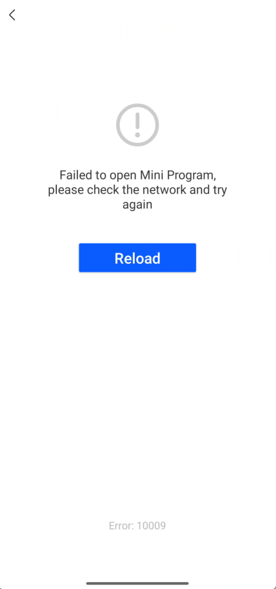

# Personalizar la vista Splash

IAPminiprogram SDK muestra una vista de salpicaduras en el lanzamiento inicial de un mini programa.Esto garantiza una experiencia de usuario suave porque permite tiempo para que el SDK cargue los datos de mini-programa.La super aplicación puede seguir esta guía para personalizar una vista de salpicaduras.

## Experiencia de usuario predeterminada
La vista de splash predeterminada incluye las siguientes dos partes:

- Una vista de carga que muestra el progreso de carga
- Una vista de error que describe el error cuando falla el lanzamiento

Puede ver ejemplos de estas dos vistas en la siguiente tabla:

<table>
    <tr>
        <th>Página Cargando</th>
        <th>Página de error</th>
    </tr>
    <tr>
        <td></td>
        <td></td>
    </tr>
</table>


## Procedimientos
Tome los siguientes dos pasos para personalizar la página Splash:


## Paso 1: Implemente grvsplashviewDelegate

Cree una clase que implementa el protocolo ```GRVSplashViewDelegate``` para definir y crear una vista Splash personalizada.Consulte el siguiente código de muestra para la implementación:

```js
@interface DemoSplashViewDelegate : NSObject <GRVSplashViewDelegate>

@end

@implementation DemoSplashViewDelegate

- (UIView *)createSplashViewWithCloseAppAction:(void (^)(void))closeAppAction {
    DemoSplashView *splashView = [[DemoSplashView alloc] init];
    splashView.closeAction = closeAppAction;
    return splashView;
}

- (void)splashView:(UIView *)splashView updateLoadingInfo:(GRVSplashViewInfo *)info {
    DemoSplashView *defaultSplashView = (id)splashView;
    [defaultSplashView updateWith:info];
}

- (void)splashView:(UIView *)splashView showErrorMessage:(NSString *)message code:(NSString *)code {
    DemoSplashView *defaultSplashView = (id)splashView;
    [defaultSplashView showErrorMessage:message code:code];
}

- (void)exitSplashView:(UIView *)splashView {
    [splashView removeFromSuperview];
}

@end

```

Para obtener más información sobre este protocolo, consulte [```GRVSplashViewDelegate```](/).

## Paso 2: Configurar GrVExtensionDelegate
Antes de la lógica de inicialización de SDK, configure ```GrVExtensionDelegate``` y registre el protocolo ```GrVExtensionDelegate``` implementado en el SDK con el siguiente código de muestra:

```js
let extensionDelegate = GRVExtensionDelegate()
extensionDelegate.uiProvider.splashViewDelegate = DemoSplashViewDelegate()
config.riverExtensionDelegate = extensionDelegate
```

## Protocolos

### GRVSplashViewDelegate
El protocolo ```GRVSplashViewDelegate``` se utiliza para personalizar una vista de salpicaduras.El siguiente código muestra la definición de este protocolo:

```swift
@protocol GRVSplashViewDelegate <NSObject>
- (UIView *)createSplashViewWithCloseAppAction:(void(^)(void))closeAppAction;
- (void)splashView:(UIView *)splashView updateLoadingInfo:(GRVSplashViewInfo *)info;
- (void)splashView:(UIView *)splashView showErrorMessage:(NSString *)message code:(NSString *)code;
- (void)exitSplashView:(UIView *)splashView;

@optional
- (UIView *)createSplashViewWithCloseAppAction:(void(^)(void))closeAppAction reloadAppAction:(nullable void(^)(void))reloadAppAction appId:(nullable NSString *)appId;
- (void)splashView:(UIView *)splashView updateLoadingProgress:(CGFloat)progress;
@end
```

Como podemos ver en el código, este protocolo proporciona los siguientes seis métodos:

<table>
    <tr>
        <th>Método</th>
        <th>Descripción</th>
        <th>Requerido</th>
    </tr>
    <tr>
        <td>createSplashViewWithCloseAppAction:</td>
        <td>
        TSDK llama a este método para crear un objeto UIView que represente una vista de salpicaduras.El UIView devuelto se agrega como una subvisión a la jerarquía de vista del SDK.El SDK luego adapta la vista al tamaño de la pantalla del dispositivo y gestiona el ciclo de vida de la vista.Para obtener más información, consulte [```createSplashViewWithCloseAppAction:```](/).
        La super aplicación debe implementar este método o el ```createSplashViewWithCloseAppAction:reloadAppAction:appId:``` Método para crear una vista de salpicaduras.
        </td>
        <td>O</td>
    </tr>
    <tr>
        <td>createSplashViewWithCloseAppAction:reloadAppAction:appId:</td>
        <td>
El SDK llama a este método para crear un objeto UIView que represente una vista de salpicaduras y habilite la funcionalidad de recarga en la vista.El UIView devuelto se agrega como una subvisión a la jerarquía de vista del SDK.El SDK luego adapta la vista al tamaño de la pantalla del dispositivo y gestiona el ciclo de vida de la vista.Para obtener más información, consulte [```createSplashViewWithCloseAppAction:reloadAppAction:appId:```](/).

La super aplicación debe implementar este método o el ```createSplashViewWithCloseAppAction:``` Método para crear una vista de splash.
        </td>
        <td>O</td>
    </tr>
    <tr>
        <td>splashView:updateLoadingInfo:</td>
        <td>El SDK llama a este método para actualizar la información mini-programas en la vista Splash.Para obtener más información, consulte [```splashView:updateLoadingInfo:```](/).</td>
        <td>M</td>
    </tr>
    <tr>
        <td>splashView:showErrorMessage:code:</td>
        <td>El SDK llama a este método para mostrar una vista de error en la vista Splash cuando falla el lanzamiento del mini-Programa.Para obtener más información, consulte [```splashView:showErrorMessage:code```](/):.</td>
        <td>M</td>
    </tr>
    <tr>
        <td>exitSplashView:</td>
        <td>El SDK llama a este método para salir de la vista Splash cuando se completa el lanzamiento del mini-Programa.Simplemente puede implementar el método `removeFromSuperview` para manejar la salida.Para obtener más información, consulte [```exitSplashView:```](/).</td>
        <td>M</td>
    </tr>
    <tr>
        <td>splashView:updateLoadingProgress:</td>
        <td>El SDK llama a este método para actualizar el progreso de carga de mini-programa en la vista Splash.Para obtener más información, consulte [```splashView:updateLoadingProgress:```](/).</td>
        <td>O</td>
    </tr>
</table>


### createSplashViewWithCloseAppAction:
```createSplashViewWithCloseAppAction:``` El método tiene el siguiente parámetro de entrada:
<table>
    <tr>
        <th>Campo</th>
        <th>Tipo de datos</th>
        <th>Descripción</th>
        <th>Requerido</th>
    </tr>
    <tr>
        <td>closeAppAction</td>
        <td>NSBlock *</td>
        <td>Un bloque de código que se ejecuta cuando el usuario aborta el proceso de carga y sale.</td>
        <td>O</td>
    </tr>
</table>


### splashView:updateLoadingInfo:
```splashView:updateLoadingInfo:``` El método tiene los siguientes parámetros de entrada:

<table>
    <tr>
        <th>Campo</th>
        <th>Tipo de datos</th>
        <th>Descripción</th>
        <th>Requerido</th>
    </tr>
    <tr>
        <td>splashView</td>
        <td>UIView *</td>
        <td>La vista de salpicaduras personalizada.</td>
        <td>M</td>
    </tr>
    <tr>
        <td>info</td>
        <td>GRVSplashViewInfo *</td>
        <td>La información del mini programa que se lanza.Este parámetro se devuelve si la identificación del programa mini abierto es válida.Para obtener más información, consulte GRVSPLASHVIEWINFO.</td>
        <td>O</td>
    </tr>
</table>


### GRVSplashViewInfo
```GRVSplashViewInfo``` El modelo tiene los siguientes parámetros de entrada:

<table>
    <tr>
        <th>Field</th>
        <th>Data type</th>
        <th>Description</th>
        <th>Required</th>
    </tr>
    <tr>
        <td>appId</td>
        <td>NSString *</td>
        <td>La identificación del mini programa.</td>
        <td>M</td>
    </tr>
    <tr>
        <td>appName</td>
        <td>NSString *</td>
        <td>El nombre del mini programa.</td>
        <td>M</td>
    </tr>
    <tr>
        <td>iconUrl</td>
        <td>NSString *</td>
        <td>La URL del icono de mini-programa.</td>
        <td>M</td>
    </tr>
    <tr>
        <td>desc</td>
        <td>NSString *</td>
        <td>La descripción del mini programa.Su valor puede estar vacío.</td>
        <td>M</td>
    </tr>
    <tr>
        <td>slogan</td>
        <td>NSString *</td>
        <td>El eslogan del mini programa.Su valor puede estar vacío.</td>
        <td>M</td>
    </tr>
</table>

### plashView:showErrorMessage:code:

```splashView:showErrorMessage:code:``` El método tiene los siguientes parámetros de entrada:

<table>
    <tr>
        <th>Campo</th>
        <th>Tipo de datos</th>
        <th>Descripción</th>
        <th>Requerido</th>
    </tr>
    <tr>
        <td>splashView</td>
        <td>UIView *</td>
        <td>La pantalla de salpicadura personalizada.</td>
        <td>M</td>
    </tr>
    <tr>
        <td>message</td>
        <td>NSString *</td>
        <td>El mensaje de error que corresponde al código de error y describe el error en detalle.Para obtener más información, consulte [Errores](/).</td>
        <td>M</td>
    </tr>
    <tr>
        <td>code</td>
        <td>NSString *</td>
        <td>El código de error del error encontrado.Para obtener más información, consulte[Errores](/).</td>
        <td>M</td>
    </tr>
</table>


### exitSplashView:
```exitSplashView:``` El método tiene el siguiente parámetro de entrada:
<table>
    <tr>
        <th>Field</th>
        <th>Data type</th>
        <th>Description</th>
        <th>Required</th>
    </tr>
    <tr>
        <td>splashView</td>
        <td>UIView *</td>
        <td>La pantalla de salpicadura personalizada.</td>
        <td>M</td>
    </tr>
</table>

### createSplashViewWithCloseAppAction:reloadAppAction:appId:
```createSplashViewWithCloseAppAction:reloadAppAction:appId:``` El método tiene los siguientes parámetros de entrada:
<table>
    <tr>
        <th>Campo</th>
        <th>Tipo de datos</th>
        <th>Descripción</th>
        <th>Requerido</th>
    </tr>
    <tr>
        <td>closeAppAction</td>
        <td>NSBlock *</td>
        <td>Un bloque de código que se ejecuta cuando el usuario aborta el proceso de carga y sale.</td>
        <td>O</td>
    </tr>
    <tr>
        <td>reloadAppAction</td>
        <td>NSBlock *</td>
        <td>Un bloque de código que se ejecuta cuando el usuario recarga el mini programa.</td>
        <td>O</td>
    </tr>
    <tr>
        <td>appId</td>
        <td>NSString *</td>
        <td>La mini ID de programa.</td>
        <td>O</td>
    </tr>
</table>


### splashView:updateLoadingProgress:
```splashView:updateLoadingProgress:``` El método tiene los siguientes parámetros de entrada:
<table>
    <tr>
        <th>Campo</th>
        <th>Tipo de datos</th>
        <th>Descripción</th>
        <th>Requerido</th>
    </tr>
    <tr>
        <td>splashView</td>
        <td>UIView *</td>
        <td>laPantallaDeSalpicaduraPersonalizada</td>
        <td>M</td>
    </tr>
    <tr>
        <td>
        progress
        </td>
        <td>CGFloat</td>
        <td>
        El progreso de carga del mini programa.
            Value range: ```0.00```-```1.00```
        </td>
M
        <td></td>
    </tr>
</table>


## Appendix
### Errors
La siguiente tabla enumera los detalles de los errores que pueden ocurrir cuando el lanzamiento del mini-Programa falla:

<table>
    <tr>
        <th>Código de error</th>
        <th>Mensaje de error</th>
        <th>Descripción</th>
    </tr>
    <tr>
        <td>1001</td>
        <td>Mini Program has been removed</td>
        <td>El mini programa se elimina de la plataforma de desarrollo de Mini Program.</td>
    </tr>
    <tr>
        <td>1002</td>
        <td>Mini Program has been suspended</td>
        <td>El mini programa se elimina del Super App.</td>
    </tr>
    <tr>
        <td>10000</td>
        <td>Unknown error</td>
        <td>Unknown error.</td>
    </tr>
    <tr>
        <td>10001</td>
        <td>Mini program does not exist.</td>
        <td>Esto podría suceder cuando la identificación de mini-programa pasada no es válida.</td>
    </tr>
    <tr>
        <td>10002</td>
        <td>Mini program unzip failed</td>
        <td>No se pudo descomprimir el paquete mini-programa.Esto podría suceder cuando el paquete descargado está dañado.</td>
    </tr>
    <tr>
        <td>10003</td>
        <td>Mini program fetch failed</td>
        <td>No se pudo obtener los metadatos mini-programa probablemente debido a problemas de red.</td>
    </tr>
    <tr>
        <td>10009</td>
        <td>Mini program download failed</td>
        <td>No se pudo descargar el paquete Mini-Program probablemente debido a problemas de red.</td>
    </tr>
    <tr>
        <td>10010</td>
        <td>Mini program preparation timed out</td>
        <td>No se pudo lanzar el programa MINI dentro del umbral de tiempo de espera de 30 segundos, que probablemente sea causado por problemas de red.</td>
    </tr>
    <tr>
        <td>10030</td>
        <td>Failed to load remote resources</td>
        <td>No se pudo descargar los recursos remotos que se requieren para ejecutar el programa MINI, que probablemente sea causado por problemas de red.</td>
    </tr>
</table>


