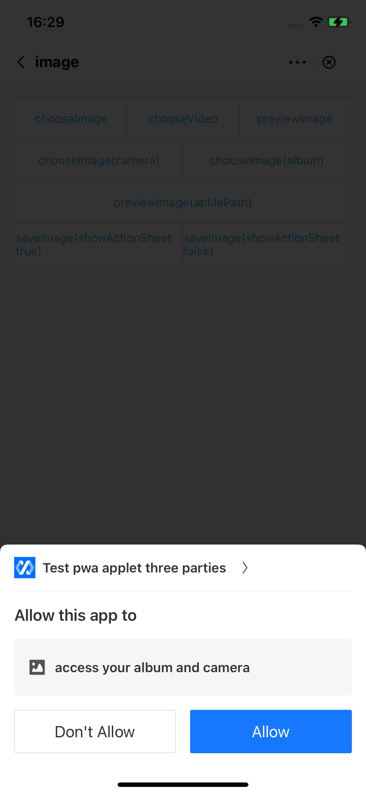
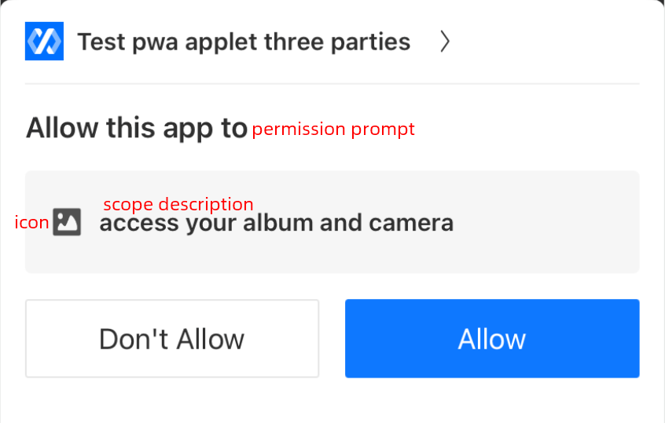

# Personalizar las vistas de autorización del usuario

Para preocupaciones de privacidad, IAPminiprogram SDK muestra vistas de autorización de usuarios cuando los mini programas llaman a JSAPIS que requieren acceso a la información confidencial de los usuarios. La super aplicación puede personalizar estas vistas para crear una interfaz de usuario que coincida con su marca y cumpla con los requisitos regionales regionales.Este tema lo guía a través de cómo personalizar la vista de autorización del usuario.

## Experiencia de usuario predeterminada
Si elige no proporcionar vistas personalizadas de autorización de usuario, el SDK muestra las vistas en forma de una ventana emergente inferior en la pantalla. Puede consultar la siguiente imagen para obtener un ejemplo de vista predeterminado:




## procedimientos
Tome los siguientes dos pasos para personalizar sus vistas de autorización:

### Paso 1: implementar GRVAuthDelegate
Cree una clase que implementa el protocolo ```GRVAuthDelegate``` para definir y crear una vista de autorización de usuario personalizada. Consulte el siguiente código de muestra para la implementación:

```js
@interface DemoAuthDelegateImpl : NSObject<GRVAuthDelegate>

@end

@implementation DemoAuthDelegateImpl
    
- (void)showAuthWithParam:(GRVAuthParam *)param
currentViewController:(UIViewController*)currentViewController
      positiveAction:(GRVAuthActionBlock _Nullable)positiveAction
        cancelAction:(GRVAuthActionBlock _Nullable)cancelAction 
{
    DemoAuthViewController *authViewController = [[DemoAuthViewController alloc] init];
    authViewController.param = param;
    authViewController.positiveAction = positiveAction;
    authViewController.cancelAction = cancelAction;
    [currentViewController presentViewController:authViewController animated:YES completion:nil];        
}
@end
```
Para obtener más información sobre este protocolo, consulte [```GRVAuthDelegate```](/).

### Paso 2: Configurar GRVExtensionDelegate
Antes de la lógica de inicialización de SDK, configure ```GRVExtensionDelegate``` y registre el protocolo GRVAUTHDELEGATE implementado en el SDK con el siguiente código de muestra:

```js
let extensionDelegate = GRVExtensionDelegate()
extensionDelegate.uiProvider.authDelegate = DemoAuthDelegateImpl();
```

## Protocolo
### GRVAuthDelegate
El protocolo GRVAuthDelegate se utiliza para personalizar la vista de autorización del usuario que está asociada con un JSAPI específico. El siguiente código muestra la definición de este protocolo:
```js
@protocol GRVAuthDelegate <NSObject>
@required
- (void)showAuthWithParam:(GRVAuthParam *)param
currentViewController:(UIViewController *)currentViewController
      positiveAction:(GRVAuthActionBlock _Nullable)positiveAction
        cancelAction:(GRVAuthActionBlock _Nullable)cancelAction;
@end
```
Como podemos ver en la definición anterior, este protocolo proporciona el siguiente método:

<table>
    <tr>
        <th>Método</th>
        <th>Descripción</th>
        <th>Requerido</th>
    </tr>
    <tr>
        <td>showAuthWithParam:currentViewController:positiveAction:cancelAction:</td>
        <td>El SDK llama a este método para mostrar la vista de autorización de usuario personalizada.Para obtener más información, [```consulteshowAuthWithParam:currentViewController:positiveAction:cancelAction:```](/).</td>
        <td>M</td>
    </tr>
</table>


### showAuthWithParam:currentViewController:positiveAction:cancelAction:

El ```showAuthWithParam:currentViewController:positiveAction:cancelAction:```El método tiene los siguientes parámetros:

<table>
    <tr>
        <th>Campo</th>
        <th>Tipo de datos</th>
        <th>Descripción</th>
        <th>Requerido</th>
    </tr>
    <tr>
        <td>param</td>
        <td>GRVAuthParam *</td>
        <td>La información de una vista de autorización del usuario.Para obtener más información, consulte GRVAUTHPARAM.</td>
        <td>M</td>
    </tr>
    <tr>
        <td>currentViewController</td>
        <td>UIViewController *</td>
        <td>El controlador de vista actual que muestra la vista de autorización del usuario.</td>
        <td>M</td>
    </tr>
    <tr>
        <td>positiveAction</td>
        <td>GRVAuthActionBlock</td>
        <td>El callback que se ejecuta cuando el usuario aprueba la autorización.</td>
        <td>O</td>
    </tr>
    <tr>
        <td>cancelAction</td>
        <td>GRVAuthActionBlock</td>
        <td>El callback que se ejecuta cuando el usuario niega la autorización.</td>
        <td>O</td>
    </tr>
</table>


### GRVAuthParam
El siguiente código muestra la definición de la interfaz ```GRVAuthParam```:

```js
@interface GRVAuthParam : NSObject
@property(nonatomic, copy)NSArray<NSString *> *scopes;
@property(nonatomic, copy)NSString *content;
@property(nonatomic, copy)NSString *title;
@property(nonatomic, strong)UIImage *authIcon;
@property(nonatomic, strong)UIImage *miniProgramLogo;
@property(nonatomic, copy)NSString *miniProgramName;
@end
```

Como podemos ver en el código anterior, esta interfaz tiene los siguientes parámetros:


<table>
    <tr>
        <th>Campo</th>
        <th>Tipo de datos</th>
        <th>Descripción</th>
        <th>Requerido</th>
    </tr>
    <tr>
        <td>scopes</td>
        <td>```NSArray<NSString *> *```</td>
        <td>
        Los ámbitos que requieren autorización del usuario al llamar a un JSAPI específico.Los valores válidos son:
            - ``Album``: El JSAPI requiere acceso al álbum del usuario.
            - ``Camera``: El JSAPI requiere acceso a la cámara del usuario.
            - ``Location``: El JSAPI requiere acceso a la ubicación del usuario.
            Para obtener cómo se asignan los valores, [consulte cómo se especifica el parámetro Scopes](/).
        </td>
        <td>M</td>
    </tr>
    <tr>
        <td>content</td>
        <td>NSString *</td>
        <td>El alcance de la descripción en la vista predeterminada.Para una ilustración visual, consulte la ilustración de la vista de autorización del usuario.</td>
        <td>M</td>
    </tr>
    <tr>
        <td>title</td>
        <td>NSString *</td>
        <td>El mensaje de permiso en la vista predeterminada.Para una ilustración visual, consulte la ilustración de la vista de autorización del usuario.</td>
        <td>M</td>
    </tr>
    <tr>
        <td>authIcon</td>
        <td>UIImage *</td>
        <td>La URL del icono en la vista predeterminada.Para una ilustración visual, consulte la ilustración de la vista de autorización del usuario.</td>
        <td>M</td>
    </tr>
    <tr>
        <td>miniProgramLogo</td>
        <td>UIImage *</td>
        <td>El logotipo del programa MINI que llama a JSAPI y requiere acceso a los ámbitos especificados.</td>
        <td>M</td>
    </tr>
    <tr>
        <td>miniProgramName</td>
        <td>NSString *</td>
        <td>El nombre del mini programa que llama al JSAPI y requiere acceso a los ámbitos especificados.</td>
        <td>M</td>
    </tr>
</table>


## Apéndices
### Cómo se especifica el parámetro de ámbitos
IApminiprogram SDK especifica el parámetro de ámbitos de acuerdo con los ámbitos requeridos de JSAPI.Sin embargo, si el usuario autoriza un cierto alcance para un JSAPI, no necesita autorización repetida para otro JSAPI.Por lo tanto, no pasamos los valores correspondientes para los ámbitos autorizados.Consulte la siguiente tabla para el JSAPIS y sus ámbitos requeridos respectivamente:

<table>
    <tr>
        <th>JSAPIs</th>
        <th>Required scopes</th>
    </tr>
    <tr>
        <td>Location JSAPIs (e.g., my.getLocation)</td>
        <td>scope.location</td>
    </tr>
    <tr>
        <td>Image JSAPIs (e.g., my.chooseImage)</td>
        <td>scope.album, scope.camera</td>
    </tr>
    <tr>
        <td>Video JSAPIs (e.g., my.chooseVideo)</td>
        <td>scope.album, scope.camera</td>
    </tr>
</table>

### Ilustración de la vista de autorización del usuario
La siguiente imagen ilustra los diversos elementos y sus posiciones en una vista de autorización de usuario predeterminada:

