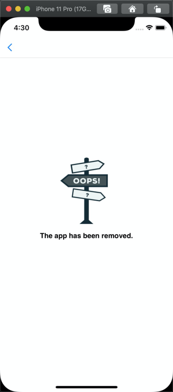
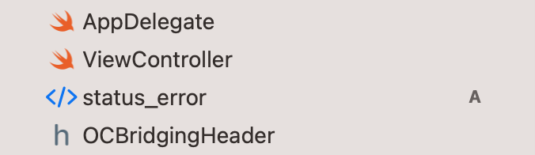

# Personalizar páginas de error

IAPminiprogram SDK muestra páginas de error cuando los errores de apertura de la página ocurren en un mini programa.Los errores caen en los siguientes dos tipos:

- Errores de red o servidor
- Errores de estado causados por estados no válidos del mini programa o la URL de la página

La Super App puede personalizar las páginas de error de acuerdo con los tipos de error y mostrar mensajes de error específicos de acuerdo con los códigos de error.

## Personalice la página de error para errores de red o servidor

Esta sección proporciona un ejemplo de una página de error predeterminada e instrucciones para personalizar la página de error para errores de red o servidor.

## Experiencia de usuario predeterminada

Para errores de red o servidor, el SDK muestra una página de error predeterminada de la siguiente manera mientras el mensaje de error y el código de error (which is Failed to open this page -1001 En el ejemplo) puede variar según el error específico encontrado.


## Procedimientos
Tome los siguientes tres pasos para personalizar una página de error para errores de red o servidor:

### Paso 1: Cree su página de error personalizado
Cree un nuevo archivo HTML para personalizar su propia página de error.Puede incorporar el siguiente código esquemático para recibir y procesar la información necesaria para la personalización:
```
error.html?a=b
```
La siguiente tabla muestra la información que se pasa cada vez que el usuario encuentra un error de red o servidor y se accede a su página de error personalizado:


<table>
    <tr>
        <th>Campo </th>
        <th>Tipo de datos </th>
        <th>Descripción </th>
    </tr>
    <tr>
        <td>errorCode</td>
        <td>String</td>
        <td>
           El código de estado del error.Los códigos caen en los siguientes dos tipos:
            - Los códigos de error de red o servidor definidos por la documentación oficial de iOS. Para obtener más información, consulte  [CFNetworkErrors](/).
            - El código de estado de error HTTP dentro de los rangos [400, 599].    
        </td>
    </tr>
    <tr>
        <td>errorMessage</td>
        <td>String</td>
        <td>El mensaje de error predeterminado que muestra el SDK. </td>
    </tr>
    <tr>
        <td>layoutDirection</td>
        <td>String</td>
        <td>
            Envía la dirección de texto en el dispositivo del usuario. Los valores válidos son:
            * ```RTL```: El texto se muestra de derecha a izquierda.
            * ```LTR```: El texto se muestra de izquierda a derecha.
        </td>
    </tr>
    <tr>
        <td>language</td>
        <td>String</td>
        <td>La preferencia de idioma en el dispositivo del usuario.</td>
    </tr>
</table>

### Paso 2: Ponga la página de error en su proyecto iOS
Coloque su página de error personalizado en su proyecto iOS como se muestra en el siguiente ejemplo:


:::info[Nota]
Para errores de red o servidor, no puede almacenar la página de error de forma remota debido a los posibles errores de conexión de red.
:::

### Step 3: Configure GRVExtensionDelegate
Before the SDK initialization logic, configure the GRVExtensionDelegate extension with the following sample code:

```js
let extensionDelegate = GRVExtensionDelegate()
//Designe su propia ruta de página de error.
extensionDelegate.uiProvider.errorPageURL = Bundle.main.path(forResource: "error", ofType: "html")
config.riverExtensionDelegate = extensionDelegate
```

## Personalizar la página de error para los errores de estado
Esta sección proporciona un ejemplo de una página de error predeterminada e instrucciones para personalizar la página de error para errores de estado.

### Experiencia de usuario predeterminada
Para errores de estado, el SDK muestra una página de error predeterminada de la siguiente manera mientras el mensaje de error (que es **The app has been removed**.en el Ejemplo) puede variar según el error específico encontrado.Para obtener más información sobre el mensaje de error predeterminado, consulte los [errores de estado](/).



### Procedimientos
Tome los siguientes tres pasos para personalizar una página de error para los errores de estado:


### Paso 1: Cree su página de error personalizado
Cree un nuevo archivo HTML para personalizar su propia página de error.Puede incorporar el siguiente código esquemático para recibir y procesar la información necesaria para la personalización:

```
status.error.html?a=b
``` 
La siguiente tabla muestra la información que se pasa cada vez que el usuario encuentra un error de estado y se accede a su página de error personalizado:

<table>
    <tr>
        <th>Campo</th>
        <th>Tipo de datos</th>
        <th>Descripción</th>
    </tr>
    <tr>
        <td>appId</td>
        <td>String</td>
        <td>La identificación del mini programa que encuentra el error.</td>
    </tr>
    <tr>
        <td>type</td>
        <td>String</td>
        <td>
        El tipo de programa mini.Los valores válidos son:
        - ```H5```: Mini programa HTML5.
        - ```MINI_PROGRAM```: Mini programa nativo.
        Para obtener más información sobre estos dos tipos de mini programas, consulte [tipos de Mini programs](/).
        </td>
    </tr>
    <tr>
        <td>errorCode</td>
        <td>String</td>
        <td>El código de estado del error.Para obtener más información, consulte los [estados de error](/)..</td>
    </tr>
    <tr>
        <td>errorMessage</td>
        <td>String </td>
        <td>TEl mensaje de error predeterminado que muestra el SDK. Este mensaje corresponde a los códigos de error.Para obtener más información, consulte los [estados de error](/).</td>
    </tr>
    <tr>
        <td>layoutDirection</td>
        <td>String</td>
        <td>
        La dirección de texto en el dispositivo del usuario.Los valores válidos son:
            - ```RTL```: El texto se muestra de derecha a izquierda.
            - ```LTR```: El texto se muestra de izquierda a derecha.
        </td>
    </tr>
    <tr>
        <td>language</td>
        <td>String</td>
        <td>La preferencia de idioma en el dispositivo del usuario.</td>
    </tr>
</table>

### Paso 2: Agregue la página de error
- Agregue la página de error personalizado a través de cualquiera de los siguientes dos métodos:

- Coloque la página en su proyecto iOS como se muestra en el siguiente ejemplo:



Aloje la página en el servicio CDN.Asegúrese de que la URL de acceso use un esquema HTTPS de la siguiente manera:
```
https://your-server-status_error.html
```


### Paso 3: Configurar GRVExtensionDelegate
Antes de la lógica de inicialización de SDK, configure la extensión GRVExtensionDelegate con la siguiente muestra Code:
```js
let config = IAPConnectInitConfig()
let extensionDelegate = GRVExtensionDelegate()
// Designe su propia ruta de página de error de estado.
extensionDelegate.uiProvider.statusPageURL = Bundle.main.path(forResource: "status_error", ofType: "html")
config.riverExtensionDelegate = extensionDelegate
```

## Apéndice
La siguiente tabla muestra los detalles de los errores de estado en un mini programa:

<table>
    <tr>
        <th>Código de error</th>
        <th>Mensaje de error</th>
        <th>Descripción</th>
    </tr>
    <tr>
        <td>1001</td>
        <td>
        El mensaje de error varía según el tipo de mini-programa:
        - Para los mini programas HTML5, el mensaje es que ```The app has been removed.```.
        - Para los mini programas nativos, el mensaje es ```The Mini Program has been removed```.
        </td>
        <td>
            El programa MINI se elimina de la plataforma Mini Program.
        </td>
    </tr>
    <tr>
        <td>1002</td>
        <td>
        El mensaje de error varía según el tipo mini-programa:
        - Para los mini programas nativos, ```The Mini Program does not exist```.
        - Para los mini programas HTML5, el mensaje es ```The app does not exist```.
        </td>
        <td>
        El programa MINI se elimina del Super App.
        </td>
    </tr>
    <tr>
        <td>10006</td>
        <td>
        El mensaje de error varía según el tipo de mini-programa:
        - Para los mini programas nativos, el mensaje es ```Load Mini Program failed```.
        - Para los programas HTML5 Mini, el mensaje es ```Load app failed```.
        </td>
        <td>
        No se pudo verificar el paquete Mini-Program debido a su invalidez, probablemente porque no está empaquetado o obtenido de la plataforma Mini Program.
        </td>
    </tr>
    <tr>
        <td>10007</td>
        <td>```No permission to load.``` </td>
        <td> La URL de la página está bloqueada porque el Mini-Programa propietario o maestro no agrega su dominio a la plataforma WhitList in Mini Program.</td>
    </tr>
    <tr>
        <td>10008</td>
        <td>```The page is not allowed to load.```</td>
        <td>El esquema especificado en la URL de la página no es válido.</td>
    </tr>
    <tr>
        <td>10009</td>
        <td>```The page is not allowed to load.```</td>
        <td>La URL de la página no usa el esquema HTTPS.</td>
    </tr>
</table>
