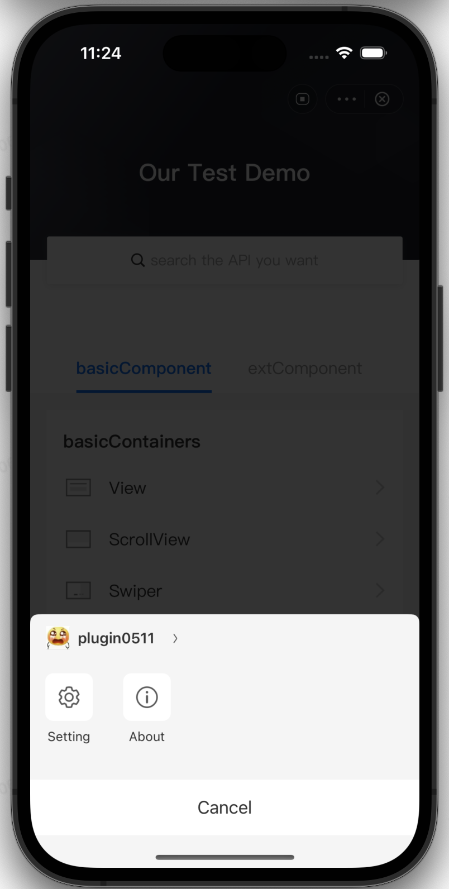

# Personalizar el menú Más

Para admitir diferentes requisitos comerciales dentro de la aplicación Super, IAPminiprogram SDK admite personalización del panel de menú. Este tema presenta cómo personalizar el panel de menú en el mini programa con el SDK.

## Experiencia de usuario predeterminada

La siguiente imagen muestra un panel de menú predeterminado donde se muestran solo la configuración y sobre los menús:



## procedimientos

Para personalizar el panel de menú, complete los siguientes pasos:

### Paso 1: Implemente GRVMPMoreMenuDelegate y getMenulist

De manera predeterminada, IAPminiprogram SDK muestra la lista de menú predeterminada que incluye la configuración y sobre los menús en el panel de menú.Si desea agregar o eliminar los menús predeterminados, debe implementar el protocolo GRVMPMoreMenuDelegate y el método GetMenulist.Para obtener más información sobre el protocolo y el método, consulte GRVMPMoreMenuDelegate y GetMenulist.Consulte la siguiente muestra para la implementación: 

```js
class DemoMoreMenuDelegate: NSObject, GRVMPMoreMenuDelegate {    
    func getMenuList(_ appId: String) -> [GRVMPMoreMenuItem] {
        let item = GRVMPMoreMenuItem()
        item.row = 2
        item.title = "Attention"
        item.icon = icon
        item.clickMenuItemAction = { context in
            
        }
        return [item]
    }
}
```
Si desea agregar el elemento de retroalimentación, consulte Utilice la capacidad de retroalimentación para requisitos más detallados.


### Paso 2: Configurar moreMenudelegate
Consulte el siguiente código de muestra para configurar Moremenudelegate en IAPminiprogram SDK:

```js
// let extensionDelegate = GRVExtensionDelegate() 
extensionDelegate.uiProvider.moreMenuDelegate = MPMoreMenuDelegateImpl()
```

## Protocolo
### GRVMPMoreMenuDelegate

```js
@protocol GRVMPMoreMenuDelegate <NSObject>

@required
- (NSArray <GRVMPMoreMenuItem *>*)getMenuList:(NSString *)appId;

@end
```
### getMenulist:
El SDK utiliza el método getMenulist: SDK para obtener la lista de elementos del menú para un determinado mini programa. Las siguientes secciones proporcionan los detalles de los parámetros de solicitud y los parámetros de respuesta de este método.

### Request parameters
<table>
    <tr>
        <th>Nombre</th>
        <th>Tipo</th>
        <th>Longitud</th>
        <th>Descripción</th>
        <th>Requerido</th>
    </tr>
    <tr>
        <td>appId</td>
        <td>String </td>
        <td>N/A</td>
        <td>La identificación del mini programa.</td>
        <td>M</td>
    </tr>
</table>


### Parámetros de respuesta
Consulte el siguiente código de muestra para devolver los parámetros de respuesta:

```js
// Un bloque que representa la acción a tomar cuando se hace clic en un elemento de menú
typedef void (^GRVMPMoreMenuActionBlock)(GRVMoreMenuContext *context);

@interface GRVMPMoreMenuItem : NSObject

/**
 El título del elemento del menú. Esto debe mantenerse conciso.
 */
@property (nonatomic, copy) NSString *title;

/**
 TEl icono del elemento del menú. Si es nulo, se utilizará un icono predeterminado. El tamaño de la imagen debe ser de 25x25 (2x).
 */
@property (nonatomic, strong) UIImage * _Nullable icon;

/**
El identificador del elemento del menú. Esta puede ser cualquier cadena que identifique el elemento del menú, como "Acerca de", "Compartir" o "Comentarios".
 */
@property (nonatomic, copy) NSString *identifier;

/**
 La fila del elemento del menú. Esta propiedad admite 1 o 2. Una fila de 1 colocará el elemento del menú en la primera fila, y una fila de 2 lo colocará en la segunda fila. Si esta propiedad no está configurada, el elemento del menú no se mostrará.
 */
@property (nonatomic, assign) NSInteger row;

/**
El bloque de código que representa la acción a tomar cuando se hace clic en el elemento del menú.
 */
@property(nonatomic, copy)GRVMPMoreMenuActionBlock clickMenuItemAction;

/**
 Este método inicializa un nuevo elemento de menú con un bloque de identificador, fila y clickmenuitemaction.
 
 @param identificador una cadena que identifica el elemento del menú, como "About", "Share", or "Feedback".
 @param fila un entero que indica la fila del elemento del menú.1 para la primera fila y 2 para la segunda fila.
 @param clickMenuItemAction Un bloque de código que representa la acción que se tomará cuando se hace clic en el elemento del menú.
 */
- (instancetype)initWithIdentifier:(NSString *)identifier row:(NSInteger)row clickMenuItemAction:(GRVMPMoreMenuActionBlock)clickMenuItemAction NS_DESIGNATED_INITIALIZER;

/**
 Este método inicializa un nuevo elemento de menú con un título de título, icono, identificador, fila y clickMenuitEmaction.
 
 @param Título El título del elemento del menú. Esto debe mantenerse conciso.
 @param Icon el icono del elemento del menú. Si es nulo, se utilizará un icono predeterminado. El tamaño de la imagen debe ser de 25x25 (2x).
 @param Identificador una cadena que identifica el elemento del menú, como "Acerca de", "compartir" o "comentarios".
 @param fila un entero que indica la fila del elemento del menú.1 para la primera fila y 2 para la segunda fila.
 @paramClickMenuitEmaction Un bloque de código que representa la acción a tomar cuando se hace clic en el elemento del menú.
 */
- (instancetype)initWithTitle:(NSString *)title icon:(UIImage *)icon identifier:(NSString *)identifier row:(NSInteger)row clickMenuItemAction:(GRVMPMoreMenuActionBlock)clickMenuItemAction;

/**
 TSu método determina si el elemento del menú debe mostrarse o no en la aplicación Mini del programa.
 
 Por defecto, este método devuelve YES.
 
 @param appId El identificador de la aplicación Mini Program para la cual se muestran más elementos del menú.
 @return YES if El elemento del menú debe mostrarse, NO de otra manera.
 */
- (BOOL)canShowForMPAppId:(NSString *)appId;

@end

```

<table>
    <tr>
        <th>Nombre</th>
        <th>Tipo</th>
        <th>Longitud</th>
        <th>Descripción</th>
        <th>Requerido</th>
    </tr>
    <tr>
        <td>N/A</td>
        <td>GRVMPMoreMenuItem</td>
        <td>N/A</td>
        <td>Los elementos del menú que necesita mostrar en el panel de menú. Para obtener más información, consulte Propiedades y método para GRVMPMoreMenuItem.</td>
        <td>M</td>
    </tr>
</table>


### GRVMPMoreMenuItem

<table>
    <tr>
        <th>Property</th>
        <th>Type</th>
        <th>Description</th>
        <th>Required</th>
    </tr>
    <tr>
        <td>identifier</td>
        <td>String</td>
        <td>El identificador único del menú.</td>
        <td>M</td>
    </tr>
    <tr>
        <td>title</td>
        <td>String</td>
        <td>El título del menú, que se muestra en el panel.</td>
        <td>M</td>
    </tr>
    <tr>
        <td>icon</td>
        <td>Image</td>
        <td>El icono del elemento del menú, que se muestra en el panel.</td>
        <td>O</td>
    </tr>
    <tr>
        <td>row</td>
        <td>Integer</td>
        <td>
        The row of the menu. The value values are:
            - ``1``: Indica que el menú está en la primera fila.
            - `` 2``: Indica que el menú está en la segunda fila.
            **Nota:** Si no establece la fila, el menú no se muestra.
        </td>
        <td>M</td>
    </tr>
    <tr>
        <td>clickMenuItemAction</td>
        <td>GRVMPMoreMenuActionBlock</td>
        <td>El bloque de código que representa la acción a tomar cuando se hace clic en el elemento del menú.</td>
        <td>M</td>
    </tr>
</table>

#### canShowForMPAppId

GRVMPMOREMENITEM utiliza el método canShowForMPAppId para decidir si se muestra el elemento del menú en el panel de menú. Consulte la siguiente muestra para implementar el método canShowForMPAppId:

```js
/**
 Decide si el elemento del menú se puede mostrar en la aplicación Mini Program.
 
El valor predeterminado es YES.
 
 @param appId NSString Representar la aplicación Mini Program, que muestra más elementos del menú.
 @return BOOL,  YES Para mostrar el elemento del menú, No para no mostrar el menú item. 
 */
- (BOOL)canShowForMPAppId:(NSString *)appId;

```


## Apéndices
### Utilizar la capacidad de retroalimentación
La función del menú de comentarios es abrir otro mini programa para recopilar los comentarios de los usuarios. Dado que IApminiprogram SDK no puede conocer la aplicación del menú de comentarios, debe decirle al SDK cuál es el APPID. De lo contrario, el menú de comentarios no se puede mostrar en el panel. Para pasar el APPID al SDK, complete los siguientes pasos:

## Paso 1: Complete GRVMPFeedbackDelegate
Consulte el siguiente código de muestra para completar el delegado GRVMPFeedBackDelegate para pasar el APPID del menú Comentarios a IAPminiprogram SDK.

```js
@protocol GRVMPFeedbackDelegate <NSObject>

@required
- (NSString *)getFeedbackMiniProgramId:(NSString *)appId;
@end
```
## Paso 2: Implemente la extensión y configúrela en IAPminiprogram SDK
Consulte la siguiente muestra para implementar la extensión y configurarla en IAPminiprogram SDK. Después de eso, puede usar la capacidad de retroalimentación y mejorar su mini programa continuamente en función de los comentarios de los usuarios.

```js
// let extensionDelegate = GRVExtensionDelegate() 
extensionDelegate.uiProvider.feedbackDelegate = DemoGRVMPFeedbackDelegateImpl()
```
