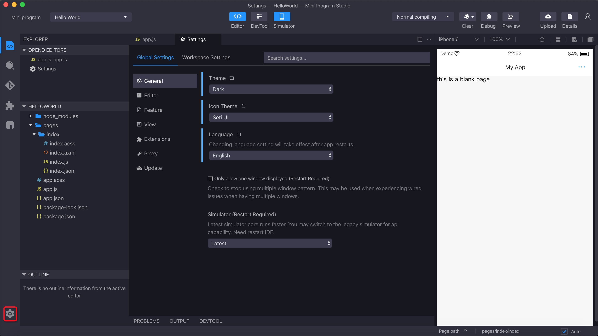

# Configuración

Haga clic en el icono de configuración en la esquina inferior izquierda para ingresar la interfaz de configuración. La configuración contiene principalmente las siguientes formas:

<ul>
    <li>
        Configuración global o configuración del espacio de trabajo sobre el editor y otras configuraciones relacionadas con la codificación.
    </li>
    <li>
        Configuración de atajos.
    </li>
    <li>
        Configuración de apariencia, como tema de color e icono.
    </li>
</ul>

