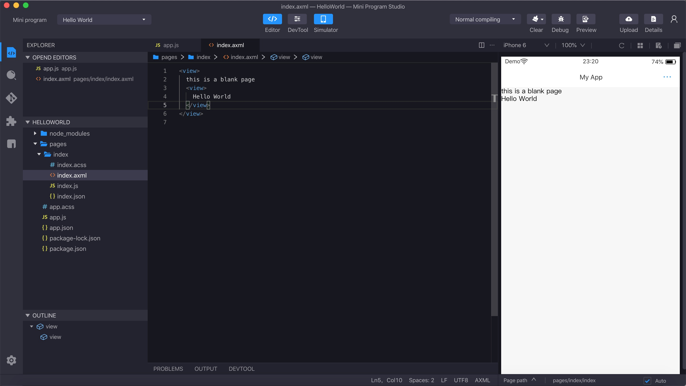
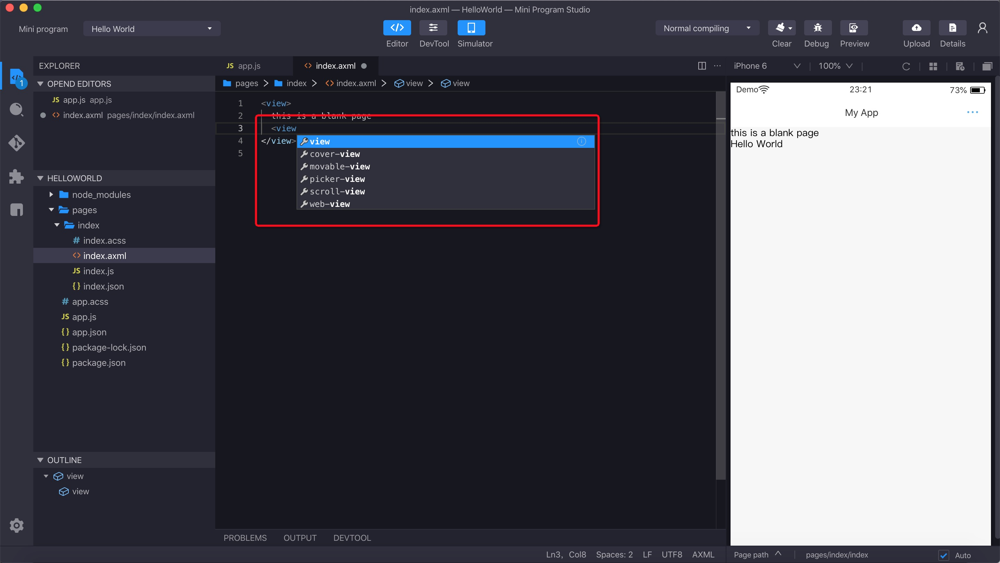
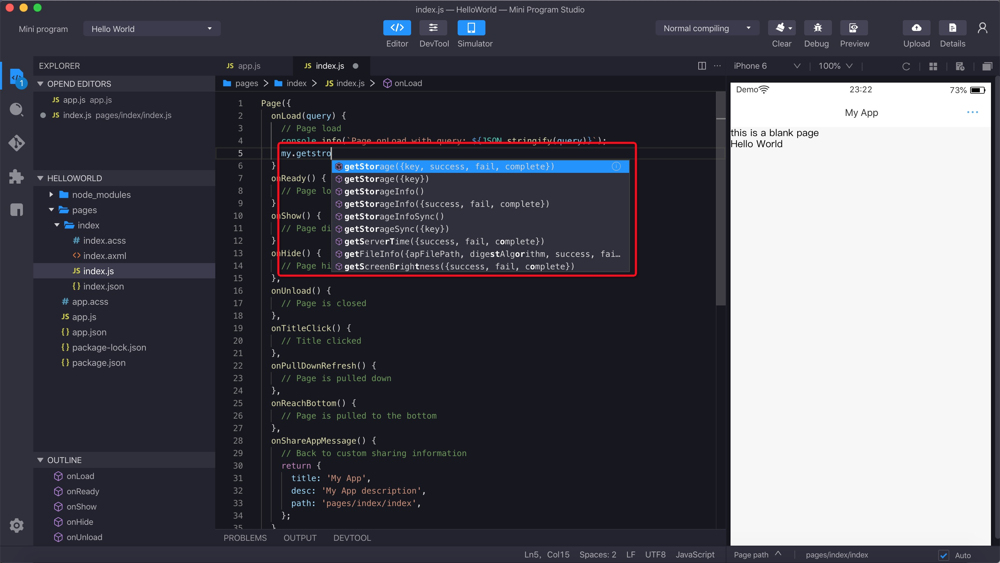

# Codificando en el editor
Define las características cuando se codifica en el editor.

## Características
Además de las funciones de edición básicas, el Mini Program Studio le proporciona las siguientes funciones que son específicas:

<ul>
    <li>
        **Vista previa en tiempo real:** puede obtener una vista previa de sus códigos en el simulador local.
    </li>
    <li>
        **Autocompletar:** sus códigos son automáticamente completos.
    </li>
    <li>
        **Aviso de sintaxis/sugerencias:** también puede obtener sugerencias sobre la sintaxis.
    </li>
</ul>

Para obtener más información, consulte las demostraciones a continuación:

## Realtime Preview

## Autocomplete

### AXML Autocomplete

### API Autocomplete

