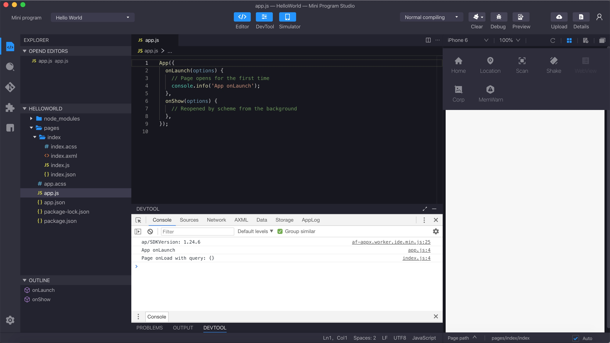
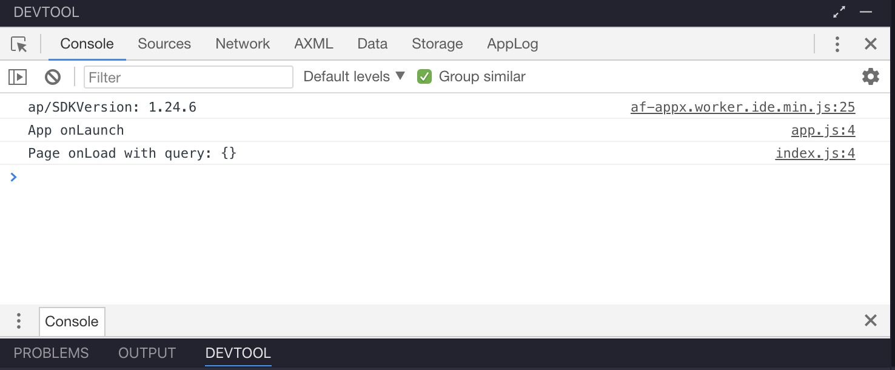

# Depuración en IDE

## Overview

Proporcionamos dos métodos de depuración:

<ul>
    <li>
        Simulador + herramienta de depuración
    </li>
    <li>
        Depuración de máquina real remota
    </li>
</ul>

El simulador puede simular la mayoría de las API de la máquina real y tiene una herramienta de depuración integrada. Sugerimos completar la función básica y la depuración de estilo en el simulador y luego realizar la verificación y depuración en la máquina real. Sin embargo, el resultado de ejecución final se basará en la máquina real.

## Simulador

El simulador proporciona las siguientes funciones:

<ul>
    <li>
        Simulación del dispositivo (dimensión, precisión, etc.)
    </li>
    <li>
        Compilación del registro, solicitud de error de compilación, actualizar
    </li>
    <li>
        Simulación JSAPI, configuración personalizada de la interfaz de simulación, incluida la posición, Bluetooth, el parámetro de inicio, etc.
    </li>
</ul>

## Herramienta de depuración

Junto con el simulador, proporcionamos Chrome DevTool personalizado y proporcionamos extensión, como AXML, en función de eso. Las extensiones predeterminadas incluyen:

<ul>
    <li>
        **AXML:** Mini Program Elementos basados en DOM, depuración de CSS
    </li>
    <li>
        **Consola:** Registro de operaciones, Visualización de errores
    </li>
    <li>
        **Almacenamiento:** visualización y edición de datos de búfer
    </li>
    <li>
        **Fuentes:** visualización del código fuente y depuración del punto de interrupción
    </li>
    <li>
        **Red:** recursos de red y solicitud de solicitudes
    </li>
</ul>

## Depuración remota

En el modo de depuración remota, se establece una conexión entre IDE y celular.Al final IDE, puede realizar una verificación de punto de interrupción, verificación de tiempo de ejecución, visualización de información de red/almacenamiento, visualización de registro remoto, etc.Vea más detalles en el documento de [Repuración remota](/).