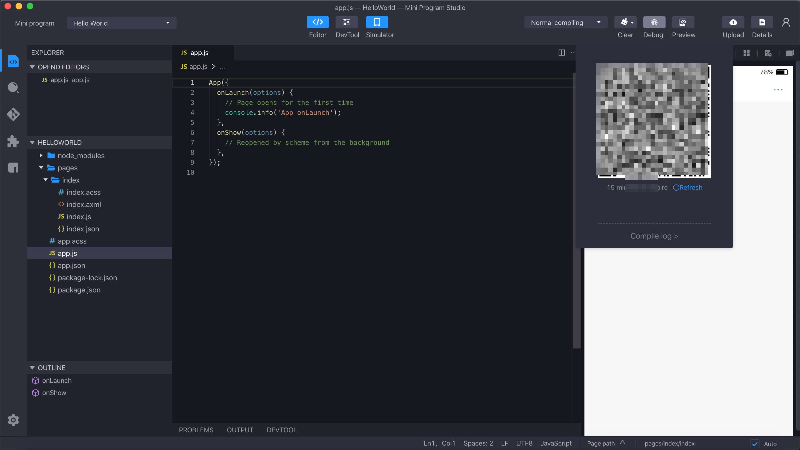
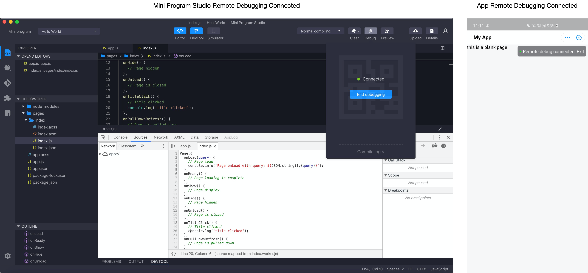
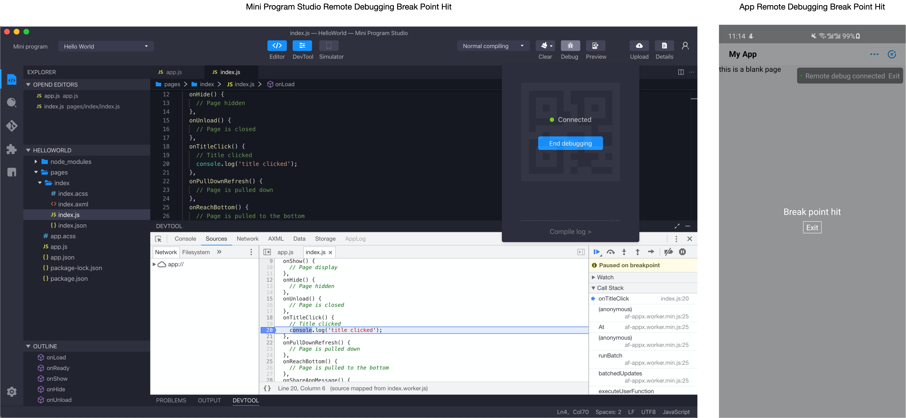

# Depuración remota

Para facilitar la depuración de la máquina real, el Mini Program Studio proporciona la función de depuración de máquina real remota. Con la depuración de la máquina real remota, puede:

<ul>
    <li>
        Realice la depuración de punto de interrupción de remota del Mini programa en IDE
    </li>
    <li>
        Ver la estructura y estilo de axml de la interfaz remota en IDE
    </li>
    <li>
        Ver la red de teléfonos celulares, el almacenamiento y otra información en IDE
    </li>
    <li>
        Ver el mini programa que ejecuta el inicio de sesión en el teléfono celular en IDE
    </li>
</ul>


Haga clic en depuración en la barra de herramientas superior derecha y presione para hacer push y generar el código QR de depuración:




Después de escanear con la aplicación, el simulador muestra la información de conexión.Mientras tanto, el teléfono celular muestra que el modo de depuración remota se ha conectado.Ahora puede abrir la ventana ```DevTool``` para depurar.



Por ejemplo, normalmente puede inspeccionar elementos AXML.

Y puedes realizar la depuración de Break Point. Simplemente seleccione la pestaña ```Sources``` del DevTool y luego elija el archivo JS específico.Puede hacer clic simple en el número de línea para agregar el punto de interrupción o hacer clic derecho en el número de línea para mostrar el indicador del punto de interrupción y luego agregar un punto de interrupción condicional.Si el punto de quiebre golpea, la línea de pinta Break se volverá azul y habrá una pista en el teléfono que muestra golpes de punto de quiebre.



Atención en la depuración remota: asegúrese de desconectar la depuración remota después de modificar el código cada vez, y luego haga push nuevamente, repita los pasos para escanear, conectar y realizar la depuración remota.