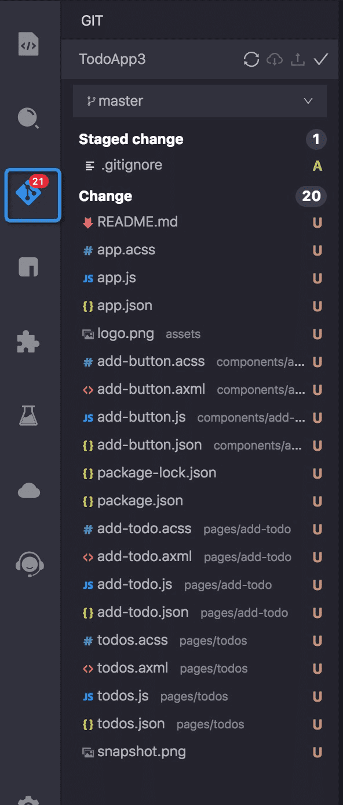
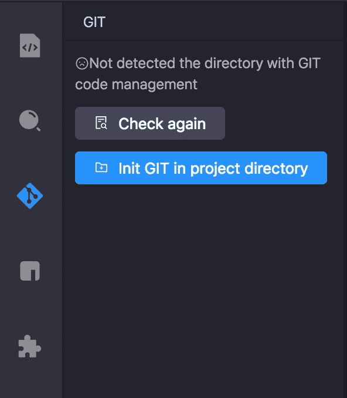
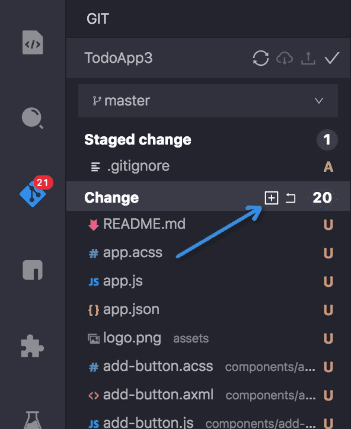
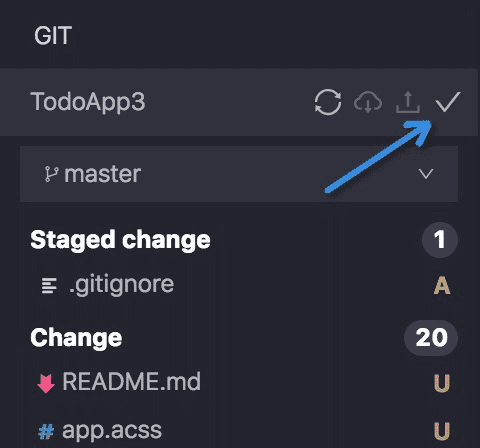
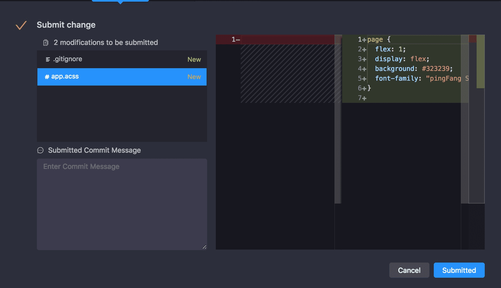
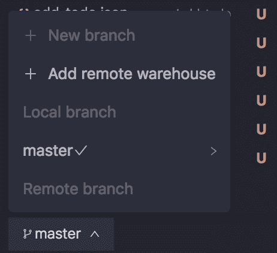
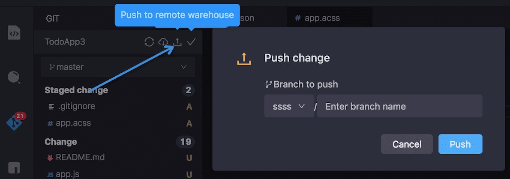

# Gestión de Git

Mini Program IDE admite el uso de la herramienta de gestión Git visualizada para administrar los códigos de proyecto.



## 1. Inicializar Git
Cuando el directorio del proyecto no tiene Git Warehouse, puede inicializar directamente Git (```git init```).



## 2. Stage Change
Puede elegir organizar todos los cambios usandondo one-key (```git add .```), o sobre el archivo individual y elegir organizar.




## 3. Enviar cambios
Envíe el cambio escenificado localmente (```git commit -m 'xxx'```)



Confirme el Diff (diferencias) de código y luego haga la operación de envío.




## 4. Push a un warehouse remoto
Agregar el warehouse (```Git Remote Add Origin xxxxxx```)



Confirmar y cargar (```git push origin```)



