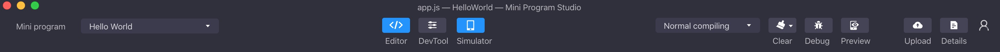
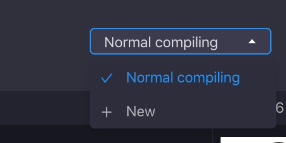
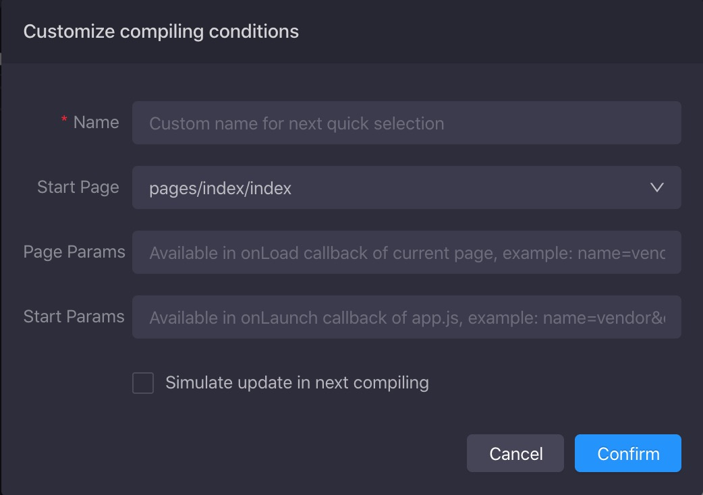
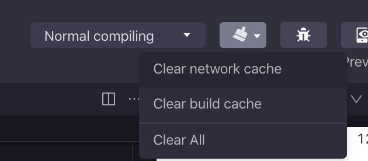
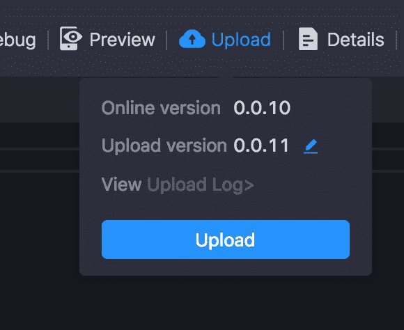
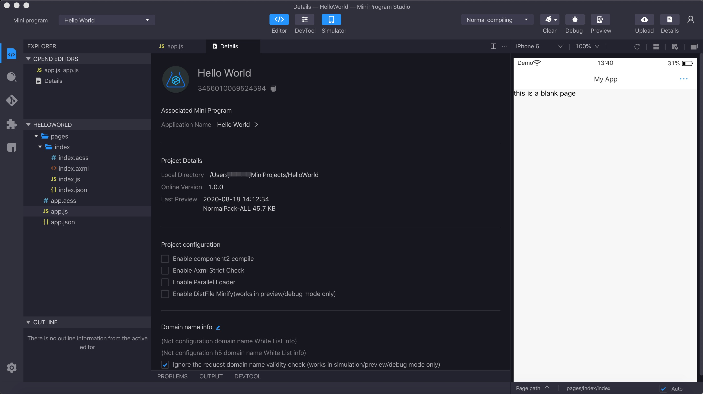

# Barra de herramientas
La barra de herramientas del Mini Program Studio se ubica en la parte superior del software.Contiene la función central del Mini Program Studio.



Puede ver las descripciones para cada opción en la barra de herramientas de izquierda a derecha.
<br />

## Mini programa asociado
Una cuenta de desarrollador puede tener múltiples mini programas. Después de iniciar sesión en la cuenta, los desarrolladores deben asociar el Mini program  en desarrollo. La aplicación asociada decide qué paquete de código se cargará a qué mini program cuando haga clic para cargar los códigos.


<br />

## Área de visualización de alternativa
El centro de la barra de herramientas puede controlar si muestra el área de codificación, la vista Devtools y el simulador.

Nota: El panel de funciones se mostrará o descartará junto con el área de codificación.El área de codificación y los Devtools no se pueden ocultar al mismo tiempo.


<br />

## Modo de compilación
Por defecto, está en modo de compilación normal. En otras palabras, el simulador de actualización predeterminado abrirá la página de inicio y no pasará en ningún parámetro. Puede agregar el modo de compilación personalizada para que comience desde otra página en el simulador actualizar con parámetros relacionados, lo que aumentará la eficiencia de la depuración.



Al hacer clic en el ```selector de compilación``` y luego hacer clic en la nueva opción, puede crear un nuevo modo de compilación.


<br />

## Limpiar cache
Borre el caché de compilación y el caché de la red.


<br />

## Depuración remota con una dispositivo real
Durante la depuración de la dispositivo real, es posible ver la información de depuración en Mini Program Studio, y también puede establecer un punto de interrupción, verificar los registros de tiempo de ejecución.Para más detalles, ver[ depuración remota](/).
<br />

## Vista previa con un dispositivo real
Use la aplicación para escanear el código QR y obtener una vista previa del Mini program  en la aplicación del dispositivo real.El código QR no será válido después de 15 minutos.
<br />

## Subir
Sobre el programa mini asociado, los códigos de mini del programa se cargan al portal de desarrolladores de mini del programa para crear un programa ejecutable en la aplicación.La versión cargada se puede especificar, si no se especifica, la versión actual se incrementa en 1 (la versión actual debe ser mayor que la versión anterior).Una vez completada la carga, se genera una versión de desarrollo única en el portal de desarrolladores de mini del programa.
Para el estándar y las especificaciones de gestión de versiones, ver [Semver](/).


<br />

## Detalles
Haga clic en el botón [Details](/) en la barra de herramientas, la ventana Detalles se mostrará en el área del editor.



Los detalles contienen principalmente información:
<br />

# La interfaz principal

La interfaz principal de Mini Program Studio contiene principalmente componentes:

<ul>
    <li>
        El Nombre del Mini del Programa Asociado, la ruta del proyecto local y la versión en línea del Mini Programa.
    </li>
    <li>
        Modificar la configuración del proyecto
        <ul>
            <li>
                Habilitar Componente2 Compilar: debe habilitarse para un componente personalizado, consulte los detalles [aquí](/).
            </li>
            <li>
                Habilitar comprobación de AXML Strict: verificará la gramática del archivo AXML en modo estricto, lo que puede ayudar a mejorar la calidad del código.
            </li>
            <li>
                Habilitar el cargador paralelo: utilizará múltiples procesos para construir el proyecto para hacerlo más rápido.
            </li>
            <li>
                Habilitar DistFile Minify: minifique el código fuente.Por defecto, en modo de vista previa y de depuración, el código no está minificado. En producción, siempre se minificará.
            </li>
        </ul>
    </li>
    <li>
        Ignore la comprobación de dominio para la API de solicitud como ```my.request```, ```my.uploadfile``` en simulación, vista previa y en modo de depuración.
    </li>
    <li>
        Ignore la verificación de dominio para el componente de visión web en simulación, vista previa y en modo de depuración.
    </li>
</ul>
<br />


## Acceso (Login)

Si no ha iniciado sesión en el Mini Program Studio, haga clic en el botón de inicio de sesión ```Login``` para iniciar sesión.

Después de iniciar sesión, haga clic en el avatar, puede optar por cerrar sesión en el mini estudio del programa. Si sale del Mini Program Studio después del cierre de sesión, la próxima vez que vuelva a abrir el Mini Program Studio, se requiere inicio de sesión.
