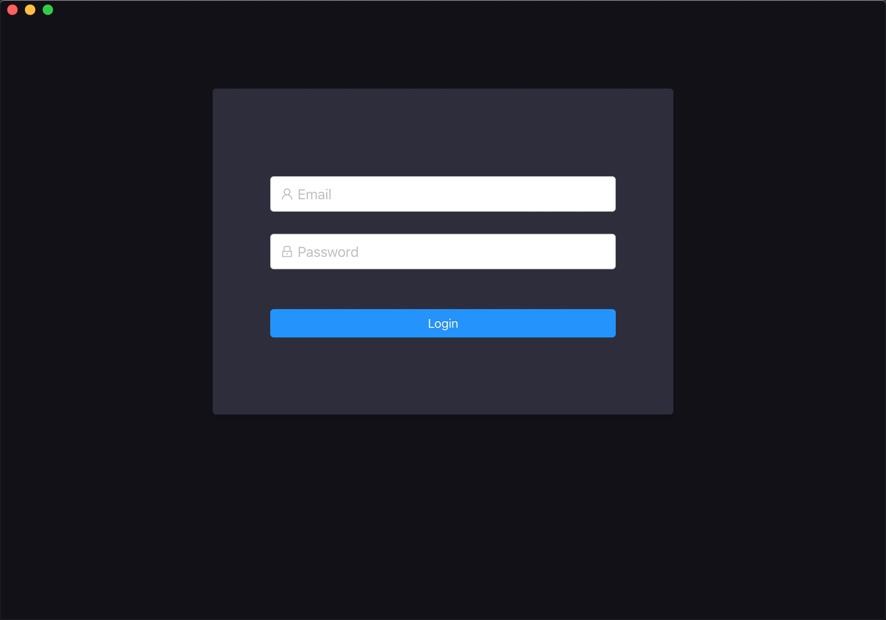
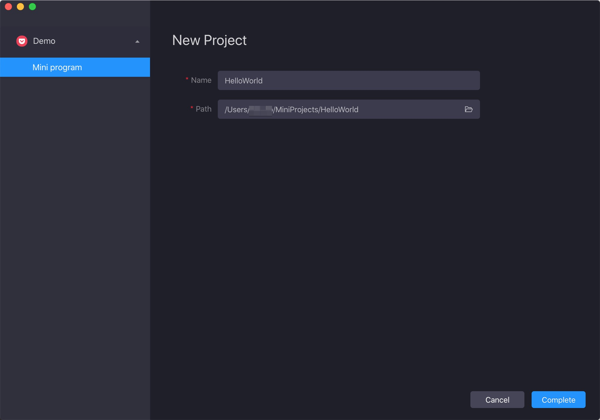
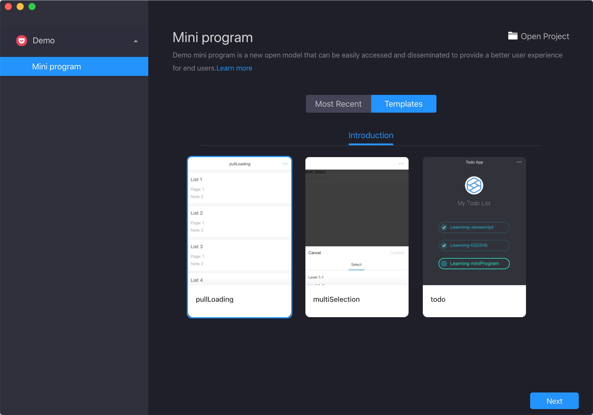
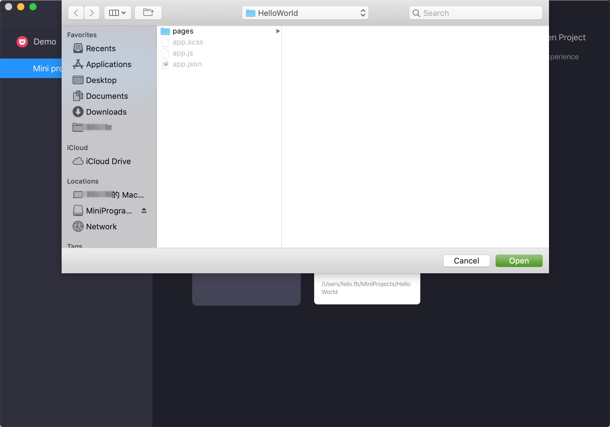
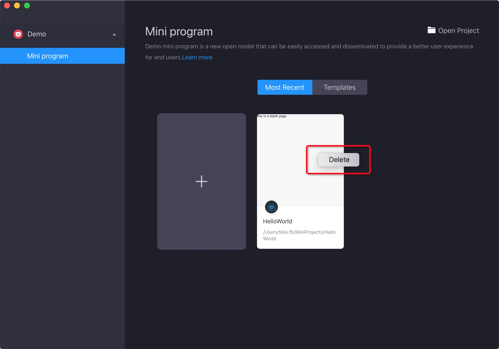

# Iniciar la interfaz de usuario

## Requisitos previos

Asegúrese de haber creado una cuenta de desarrollador.Para obtener más información, consulte [Solicitar una cuenta](/).


## Características

Cuando inicia el Mini Program Studio, puede realizar las siguientes tareas en la interfaz de usuario.

<ul>
    <li>
       Acceso
    </li>
    <li>
        Espacios de trabajo unidos
    </li>
    <li>
        Crear un nuevo mini programa
    </li>
    <li>
        Abra un mini programa existente
    </li>
    <li>
        Eliminar un mini programa
    </li>
</ul>

Para obtener más información, consulte las demostraciones a continuación:


## Acceso (Login)

La primera vez que abre el Mini Program Studio, se requiere inicio de sesión.Puede usar la cuenta que se aplica del portal de desarrolladores de Mini programs para iniciar sesión en el Mini program.



Si se olvida la contraseña, intente recuperar la contraseña en el [portal de desarrollador de mini programa](/).


## Los espacios de trabajo unidos
Después de iniciar sesión, puede ver qué espacios de trabajo se ha unido en el lado izquierdo de la interfaz de lanzamiento.


Un desarrollador puede unirse a múltiples espacios de trabajo mediante la invitación de los administradores del espacio de trabajo, y los mini programas se separan en diferentes espacios de trabajo.Así que aquí puede desarrollar diferentes proyectos de mini programa para diferentes espacios de trabajo.


## Crear un nuevo mini programa
La primera vez que abre el mini program, puede crear un nuevo proyecto de mini program. El Mini Program Studio ha proporcionado dos formas de crear un nuevo mini programa:


<ul>
<li>
Creación de un proyecto de andamio de mini programa, contiene archivos básicos de un mini programa.
    </li>
    <li>
Creación de un mini programa a partir de las plantillas proporcionadas, que proporciona los códigos de plantilla y le ayuda a completar el programa mini rápidamente.
    </li>
</ul>

### Creación del proyecto de andamio

Al hacer clic en ```Agregar tarjeta``` en la interfaz de lanzamiento, puede crear un proyecto de andamio. En la página de configuración del proyecto, debe configurar las siguientes propiedades:

<ul>
<li>
Nombre del proyecto: Nombre del proyecto que se mostrará en el Mini Program Studio.El espacio no está permitido en el nombre.Le recomendamos que use letras para establecer un nombre de significado.
</li>
    <li>
Ruta del proyecto: ubicación para guardar el proyecto en el disco.
    </li>
</ul>

Después de la configuración de las propiedades, haga clic en el botón Complete para completar la creación del Mini Programa.




### Creación del proyecto de plantilla
En la interfaz de lanzamiento, hay un botón de plantillas.Haga clic en él, puede ver que hay tres plantillas y habrá más plantillas en el futuro.



Elija una plantilla y luego haga clic en ```Next```. Luego, de manera similar al crear un nuevo mini programa, configure el nombre y la ruta para el proyecto y haga clic en el botón ```Complete``` para completar el proceso de creación.`


## Abra un mini programa existente
Si ha creado un proyecto mini del programa antes, o tiene un proyecto de mini programa local que puede desde una fuente de GIT, puede abrirlo con la función de ```Open Project```.


### Abrir proyecto local
Después de hacer clic en el botón ```Open Project```, aparecerá un selector local, debe seleccionar la ruta raíz de su proyecto Mini del Programa local y luego confirmar la selección.




### Open Proyecto abierto reciente abierto

Si ha abierto un proyecto de mini programa antes, se mostrará en la interfaz de lanzamiento.Puede hacer clic en la tarjeta para abrir el proyecto directamente.


## Eliminar proyecto

Si no desea que la interfaz de lanzamiento muestre demasiados proyectos abiertos, puede hacer clic derecho en la tarjeta de proyecto y luego se mostrará una ventana emergente Eliminar, luego puede eliminarla de la interfaz de lanzamiento para limpiar la interfaz.




> Note: the delete function will not remove the local project files, only remove the entries in the launch interface.
