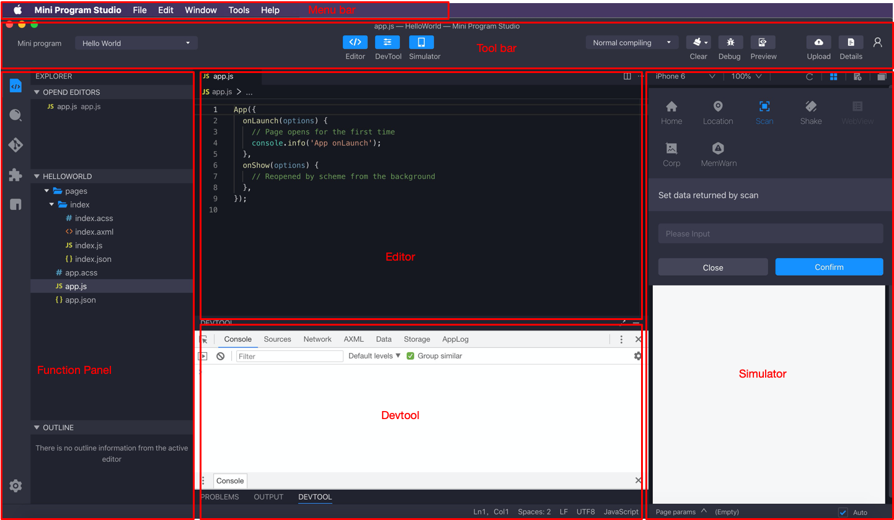

# La interfaz principal

La interfaz principal de Mini Program Studio contiene principalmente componentes:

# La interfaz principal

La interfaz principal de Mini Program Studio contiene principalmente componentes:

<ul>
    <li>
        Barra de menú: incluyendo archivos, editor, ventana y otras configuraciones básicas de software, estas configuraciones son similares con la configuración del software de desarrollo normal.
    </li>
    <li>
        Barra de herramientas: incluyendo funciones como asociar el mini programa, alternar pantallas, vista previa, depuración remota, carga y otras funciones para el mini programa.
    </li>
    <li>
        Panel de funciones: incluyendo gestión de archivos de proyecto, búsqueda, [gestión de git](/), [gestión de paquetes NPM](/) y otras funciones.
    </li>
    <li>
        Editor: para la codificación de mini programa.
    </li>
    <li>
        Simulador: [simulador local](/) para una vista previa de mini programa y [depuración remota](/).
    </li>
</ul>

