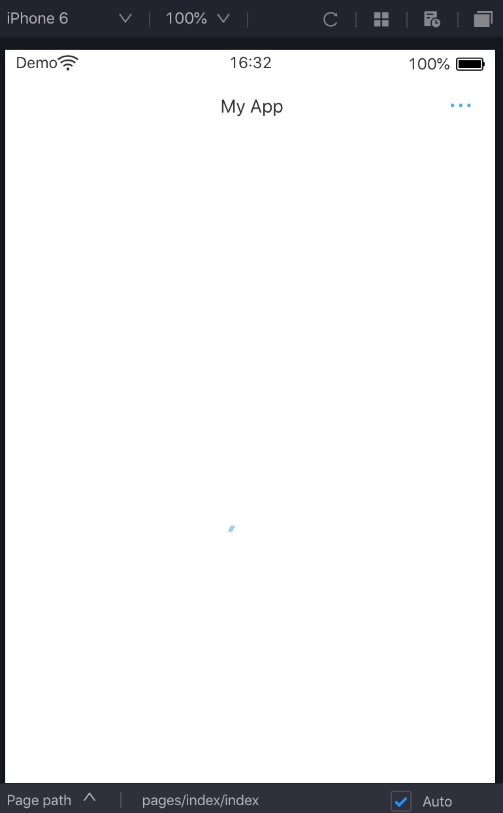
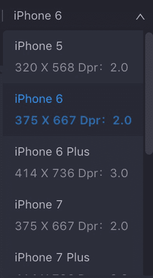
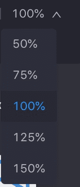
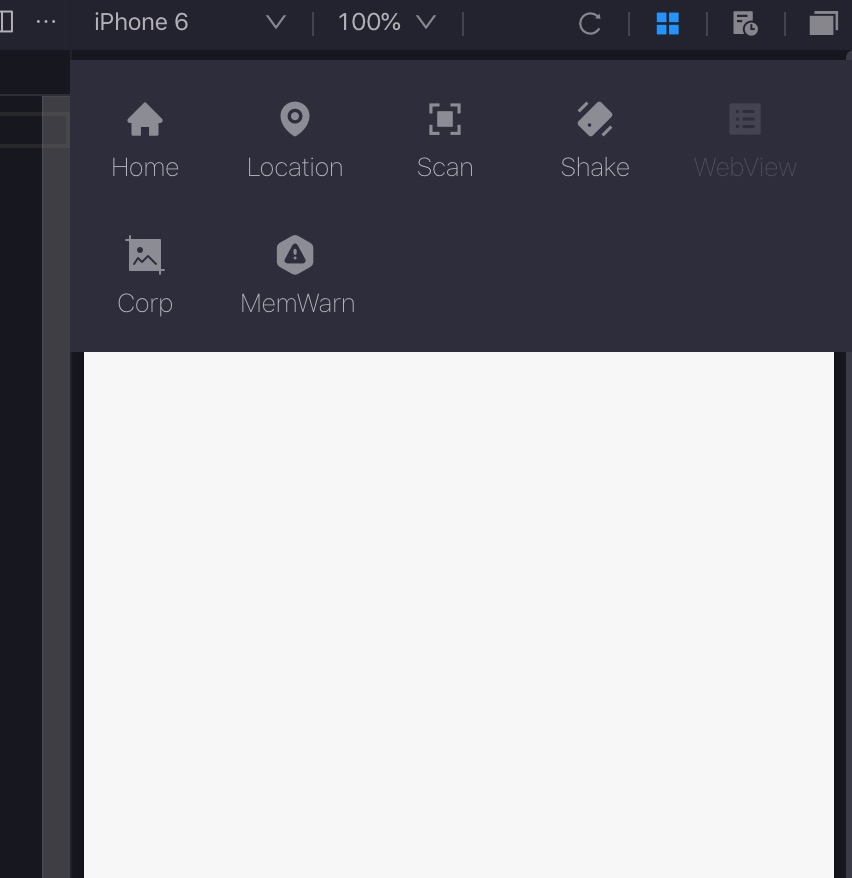
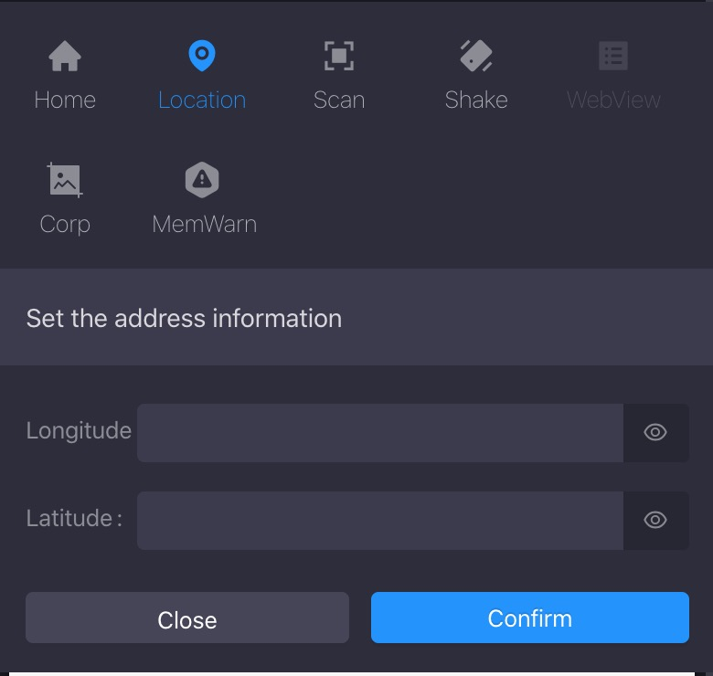

# Simulador

Después de que se desarrolle el proyecto MINI del programa, se ejecutará en el simulador automáticamente.Puede hacer clic y deslizar en la pantalla para simular el movimiento de clic y deslizar en un dispositivo real.

Por defecto, cada vez que guarde los cambios del código, el simulador se actualizará automáticamente para lograr la actualización en tiempo real.Si desea deshabilitar la función, cancele la selección de actualización automática en la parte inferior del simulador.



La parte superior de la ventana del simulador contiene principalmente funciones:

<ul>
    <li>
       Interruptor de dispositivo: elija dispositivos de diferentes tamaños, incluidos iOS y Android.También puede crear un dispositivo personalizado.
    </li>
    <li>
        Control de escala: controlar la escala del mini programa.
    </li>
    <li>
        Actualizar: compile el proyecto y actualice el simulador.
    </li>
    <li>
        Herramientas: Herramientas para datos de simulación, como puede burlarse de la ubicación.
    </li>
    <li>
        Registro de simulación: marque los registros de compilación.
    </li>
    <li>
        Ventana independiente: configure el simulador en una ventana independiente.
    </li>
</ul>

La parte inferior de la ventana del simulador contiene principalmente funciones:

<ul>
     <li>
        Ruta de la página: Mostrar ruta de página actual.Haga clic en la ruta, el archivo ```.js``` relativo se abrirá automáticamente.
    </li>
    <li>
        Parámetros de la página: Muestre los parámetros de la página actual.
    </li>
    <li>
        Actualización automática: casilla de verificación para actualización automática del simulador.
    </li>
</ul>


## Selector del dispositivo
El desarrollador puede seleccionar diferentes dispositivos o agregar un dispositivo personalizado para depurar el problema de adaptación del Mini program en los modelos de diferentes tamaños.




## Control de escala
El desarrollador puede escalar la visualización del simulador a través de porcentajes preestablecidos.



## Herramientas de simulación
Las herramientas de simulación son una función útil para los desarrolladores. Haga clic en el menú Herramientas, puede mostrar u ocultar el panel Herramientas.




## Home
Haga clic en el botón Inicio(```Home```), el mini programa irá a fondo, que se puede utilizar para probar la función ```Onshow``` y ```onHide``` en ```App.js``` o ```Page.js```.


## Location
Haga clic en el botón Ubicación (```Location```), puede simular de la ubicación del simulador. Entonces ```my.getLocation``` devolverá los datos simulados.
Nota:
Se requiere float data al ingresar la longitud y la latitud.




## Scan
Simulando la API ```My.scan```, puede ingresar el resultado del escaneo, luego en mini programa, ```My.scan``` obtendrá los datos simulados.

## Shake
Simule el agitado del dispositivo, para probarlo use ```My.WatchShake``` API.

## Corp
Simule el evento de captura de pantalla de los usuarios, para probarlo use ```my.onuserCapturescreen``` API.

## Memwarn
Simule el evento de advertencia de memoria de la aplicación, para probarlo use ```my.onmemorywarning``` API.

