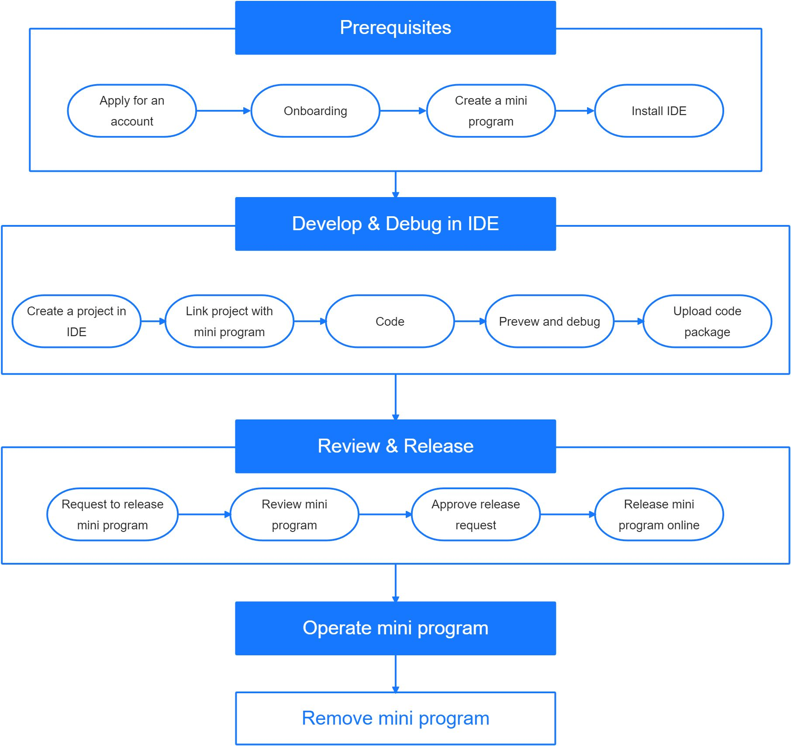

# Inicio rápido

Este tutorial está diseñado para comenzar con el desarrollo de un mini program rápidamente.

Puede ver todo el ciclo de vida del desarrollo de un mini program en la siguiente figura:

 
 

> Figura 1. Ciclo de vida del Mini program

## Descripción general del desarrollo del programa

El ciclo de vida de un mini program cubre desde la creación de una cuenta de desarrollador para lanzar el programa MINI.

### Requisito previo

Antes de comenzar, asegúrese de haber completado la siguiente configuración:

<ol>
<li>
    Solicite una cuenta para unirse a la plataforma Mini Program.

    Como desarrollador, puede unirse a la plataforma para ser un administrador de mini program o un desarrollador de mini program después de recibir una invitación por correo electrónico.
</li>

<li>
    Complete el proceso de incorporación.
</li>
    <li>
        Crea un mini program.
        <ul>
            <li>
            Si es un administrador de mini program, puede solicitar crear un mini program en la plataforma de mini program y enviar los detalles del mini del programa, incluidos, entre otros: nombre, descripción, imagen del logotipo, etc., después de que la creación sea exitosa, un únicoEl identificador se asignará al recién creado Mini Program.
            </li>
            <li>
            Si es un desarrollador de mini program, el administrador de mini del programa puede agregarlo como miembro de un mini program.
            </li>
        </ul>
    </li>
<li>
Descargar mini program de programa
</li>
</ol>

 

### Desarrollar y depurar en IDE

<ol>
    <li>
    Cree un proyecto en Mini Program Studio.
    </li>
    <li>
    Enlace el proyecto con el Mini Program que se crea en la plataforma Mini Program.
    </li>
    <li>
    Código y depuración.
    </li>
    <li>
    Cargue el paquete de código de Mini Program Studio a Mini Program Platform.
    </li>
</ol>

### Revisión y lanzamiento

<ol>
    <li>
  Revise el Mini Program y solicite lanzar el Mini Program.
    </li>
    <li>
   Administrador del espacio de trabajo revisa y aprueba la solicitud de liberación.
    </li>
    <li>
    Lanza el mini program.
    </li>
</ol>

Los usuarios ahora pueden abrir el mini program en la aplicación.

Además, las capacidades de marketing se pueden habilitar para el Mini Program para escenarios operativos.Y el ciclo de vida de un mini program finaliza cuando se elimina un mini program de la plataforma de mini program.

### Próximos pasos

Los desarrolladores pueden obtener más información sobre Mini Program en la documentación de inicio rápido:

<ul>
    <li>
    [Solicitar una cuenta.](/docs/QuickStartGuide/Solicitar%20una%20cuenta)
    </li>
    <li>
    [Ejecute el primer mini program rápidamente](/docs/QuickStartGuide/Pruebe%20la%20demo%20de%20miniprogram) Mediante el la demo disponible de Mini Program Studio.
    </li>
    <li>
    [Know more about the Mini Program project structure.](/)
    </li>
    <li>
    According to the project structure knowledge, [learn more about the demo Mini Program.](/)
    </li>
    <li>
    [Learn how to publish a Mini Program.](/)
    </li>
</ul>

