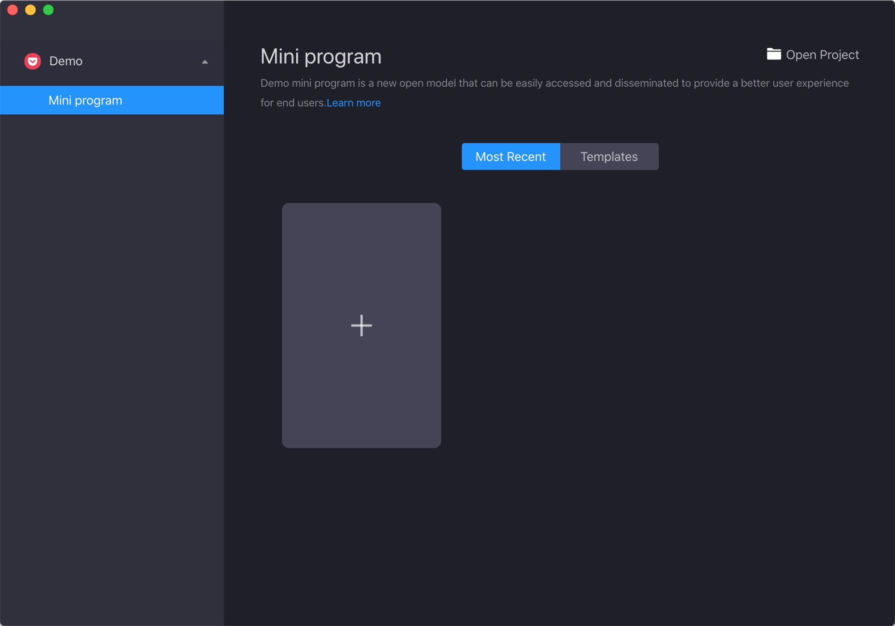
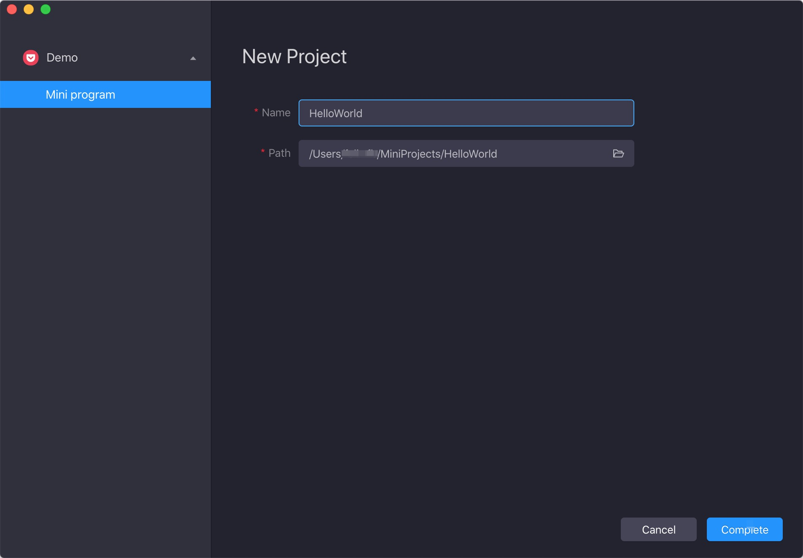
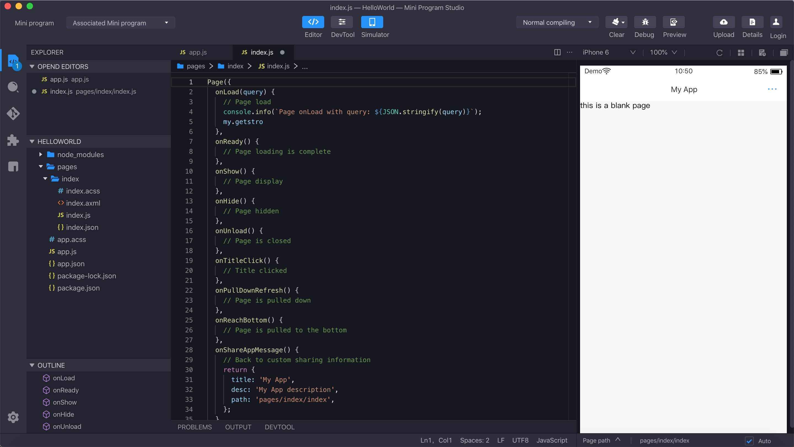

# Pruebe la demo de miniprogram

## Descargar Mini Programa Studio
En primer lugar, descargue Mini Program Studio. Es una aplicación de escritorio que ayuda al desarrollo del Mini Program, incluida la depuración local, edición de código, vista previa en el dispositivo, publicación y otras funciones que cubren todo el flujo de trabajo del desarrollo del Mini Program.

## Pruebe su primer miniprograma
Abra el IDE y haga clic en '+' para agregar un nuevo proyecto.

 
Ingrese el Nombre del Mini Program y seleccione la ruta del proyecto, luego haga clic en 'Completar' para abrir el proyecto.

 
Vista previa de su primer Mini Program en el editor.

 
Ahora ha completado la creación de su primer proyecto de mini programa en local. A continuación, comience su viaje en el editor en el lado derecho.

El siguiente contenido introduce en los pasos cómo desarrollar la demo y obtener su flujo de trabajo de desarrollo básico. Después del desarrollo, consulte el [flujo de lanzamiento](/) para publicar el Mini Program.