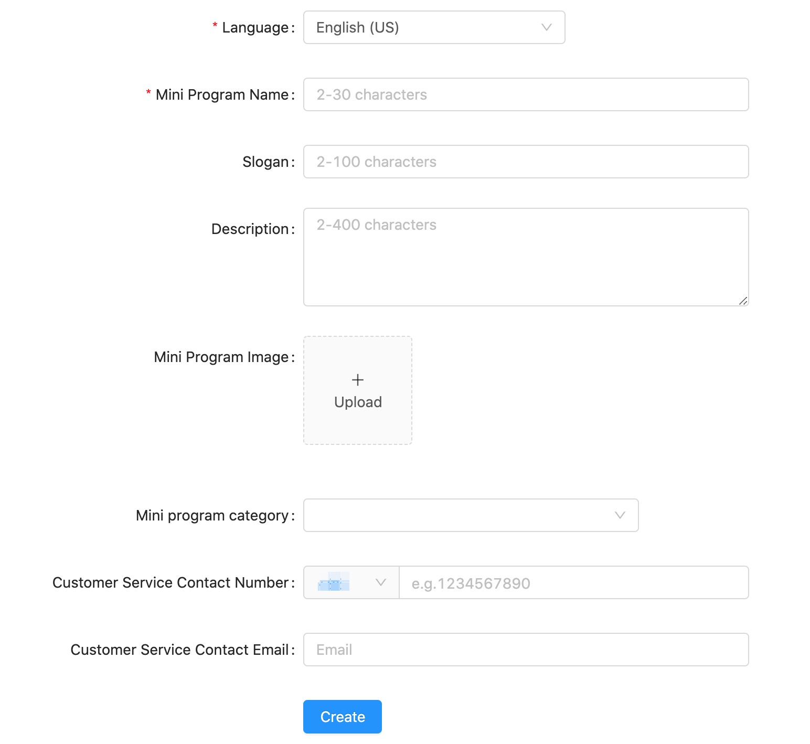
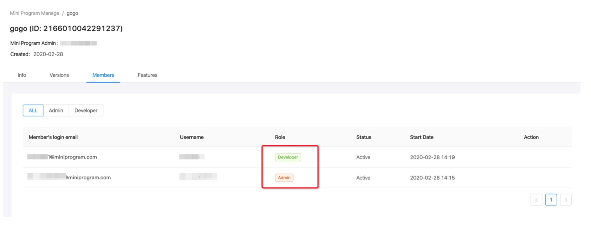
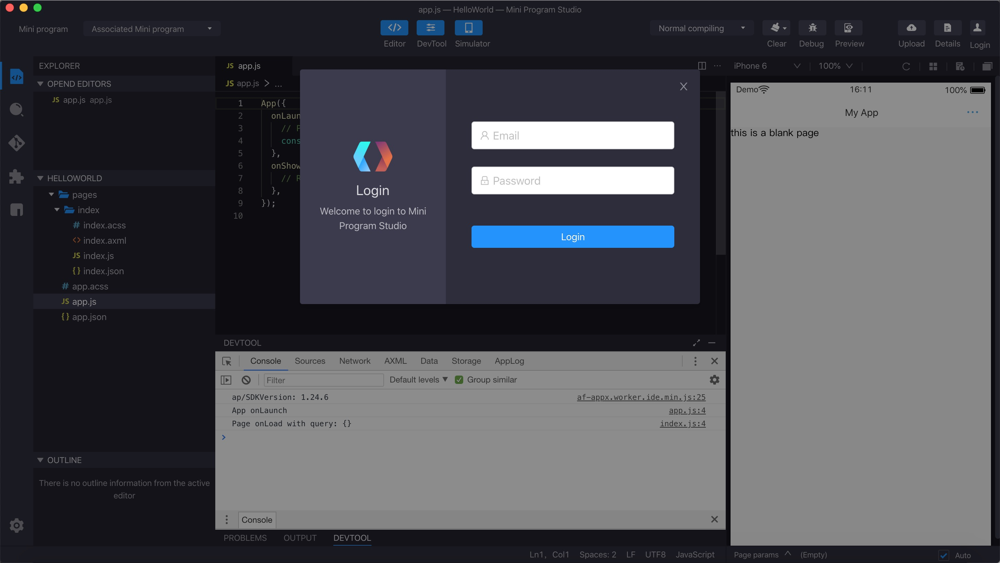
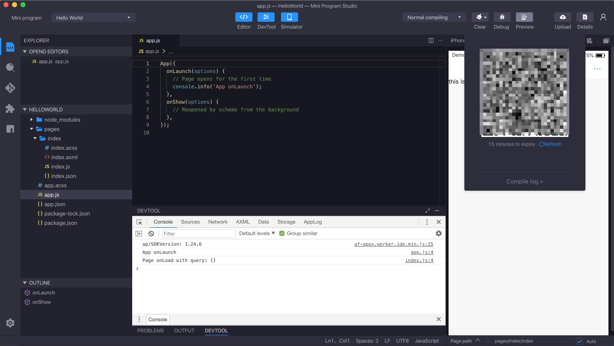
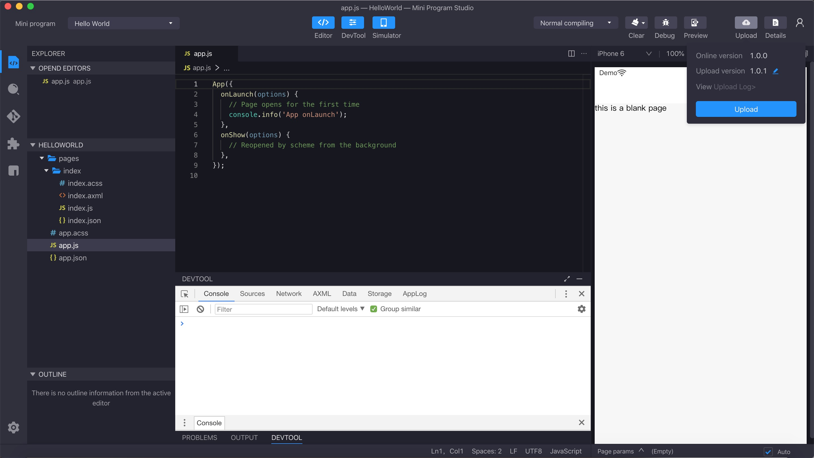
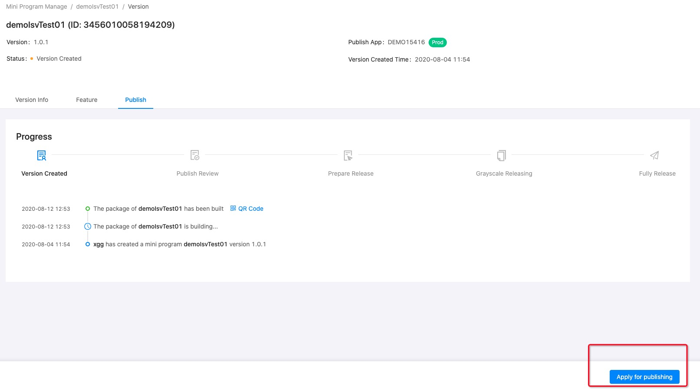
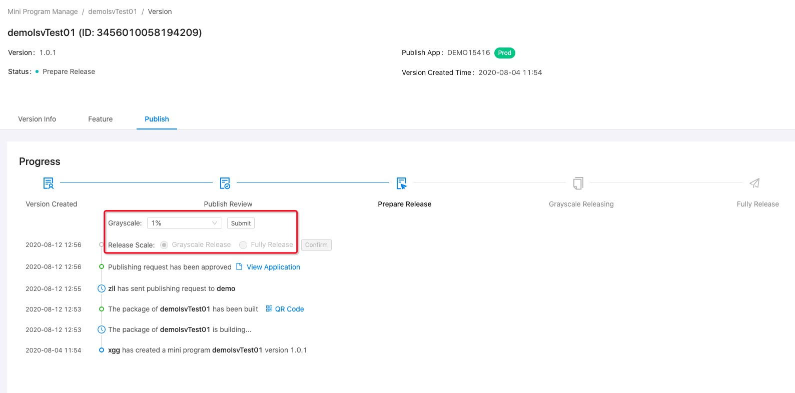

Hasta ahora, el mini program que se está desarrollando se puede ejecutar dentro del simulador IDE. Solo después de la publicación, el mini program estará disponible en la aplicación móvil en AppContainer-integrated.

## Crear mini programa
Antes del lanzamiento, el Mini program debe crearse en la plataforma de desarrollo de Mini Program. Si es un administrador de mini program, puede crear un nuevo mini program en la plataforma. Si es un desarrollador normal, debe pedirle al administrador del Mini Program que lo agregue al grupo del recién creado Mini Program.

Mini Program Admin puede crear un nuevo Mini Program en la plataforma de desarrollo de Mini Program.

 

## Agregar miembro en mini program

Si es un desarrollador normal de Mini Program, comuníquese con su administrador de mini program para agregarlo a los miembros del mini program. Y si usted es un administrador de mini program, agregue los desarrolladores en el mini program específico.

 

## Iniciar sesión en IDE

Asegúrese de que el IDE esté en la página de inicio de sesión. Haga clic en el botón de inicio de sesión en la esquina superior derecha para mostrar el cuadro de diálogo de inicio de sesión y complete su cuenta para iniciar sesión.

 

## Vista previa

La función de vista previa permite al desarrollador obtener una vista previa del mini program en un dispositivo real.
La función de vista previa requiere inicio de sesión a través del código QR y la selección de la aplicación asociada.

 

## Cargar

Cuando el mini programa esté listo para cargar, haga clic en la esquina superior derecha para cargarlos. Después de la confirmación, los códigos se cargan a la plataforma Mini Program.Ahora se genera un Mini program de versión de desarrollo en la plataforma. Si hace clic en cargar varias veces, se generará una nueva versión mini programa. Tenga en cuenta que la versión más nueva no sobrescribe la más antigua.

 

## Enviar para revisar
Solo el administrador de mini program puede enviar para la revisión, el administrador puede iniciar sesión en la plataforma, busque la versión que el desarrollador ha cargado, y haga clic en el botón Aplicar para solicitar una revisión. Y luego espere el resultado de revisión del Mini Program.

 

## Publicar un mini program
Cuando se completa el proceso de revisión del mini programa, el administrador del mini del programa podría seleccionar realizar una versión por etapas o una versión completa para llevar el mini program a la producción.

