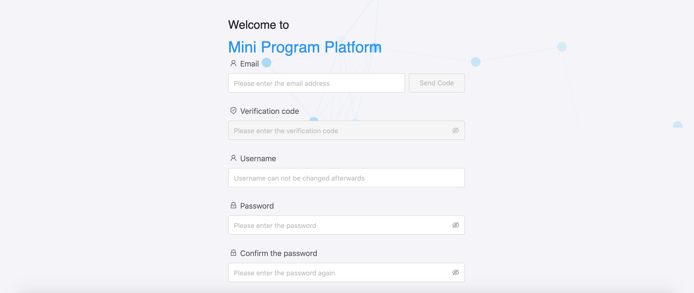

# Solicitar una cuenta

Antes de desarrollar un mini programa, debe crear una cuenta de desarrollador, que le permita crear, desarrollar o publicar su mini programa.

Pida al administrador del espacio de trabajo que lo invite a unirse al espacio de trabajo para ser un administrador de mini programa o un desarrollador de mini programa.Tenga en cuenta que el desarrollador puede desarrollar el mini programa, y solo el administrador de mini del programa puede crear y publicar el programa mini.

Al hacer clic en el enlace dentro del correo electrónico de invitación que recibió, puede crear su cuenta como se muestra a continuación.

Complete la información, luego puede finalizar el proceso de creación de cuentas.